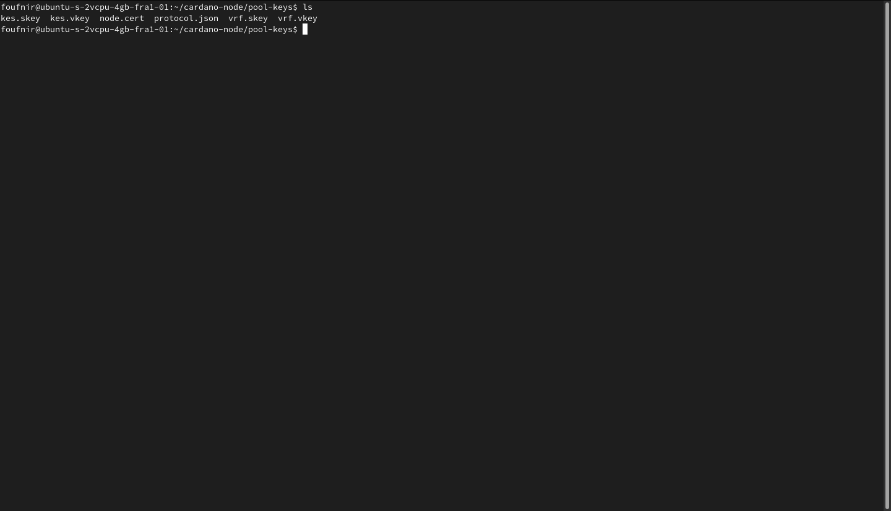

We are now at one of the most important parts of this guide. You really **do not** want to skip this part, as we will now be backing up our files, to ensure our stakepool is safe in any circumstances.

### Backing up your files

**9.01** First, open a new terminal tab, and this time, **do not** log into your VPS.

**9.02** Now execute the following command to download the *pool-keys* folder from your VPS:

:::note
- Replace *YourUserNameOnYourLOCALcomputer* with the username you are using on your own computer.

- Replace *YourUserNameOnYourVPS* with the username you are using on the VPS  of your block-producing node.

- Replace *TheIPaddressOfYourVPS* with the IP address of the VPS of your block-producing node.

- **Important**: you may need to adjust the path (the path is for example */home/max/Documents/*) if you have a different folder structure on your computer, or if you are using a different language on your PC.

In my case, this is what the command looks like:

```jsx
rsync -de "ssh -i /home/max/.ssh/myssh -p 3100" foufnir@I'm-not-giving-you-the-IP-address:/home/foufnir/cardano-node/pool-keys /home/max/Documents/
```
:::
```jsx
rsync -de "ssh -i /home/YourUserNameOnYourLOCALcomputer/.ssh/myssh -p 3100" YourUserNameOnYourVPS@TheIPaddressOfYourVPS:/home/YourUserNameOnYourVPS/cardano-node/pool-keys /home/YourUserNameOnYourLOCALcomputer/Documents/
```

**9.03** OK! If everything went well, you should now see a *pool-keys* folder in your *Documents* folder on your **local computer**.

**9.04** Your job is pretty simple now, but incredibly important.

First, move the *pool-keys* folder to **at least** two external storage solutions. This can be a USB stick, an SD card, an external hard-drive,... It can be everything, except storage solutions which are connected to the internet.

**Do not** store them on your computer. **Do not** store them in the cloud. **Do not** store them on your phone.

**9.05** Once you have done this, make sure to triple-check everything is as it should, move the *pool-keys* folder to the trash, **and** empty it.

**9.06** Now connect to your VPS

:::caution Are you delegating to POA?
If not, please do. It's the only way we generate funds, which we can afterwards use to invest in our activities in Africa to get Cardano adopted there, but also to create more of the guides like the one you are currently using to create your stakepool.

Our ticker is **[POA](https://adapools.org/pool/683e89fa1bcde139504b11fbfd914f8ebe9b8db2678b3da0abdcb2f1)**. You know what to do.

**Make the difference. #StakeWithAfrica**
:::

**9.07** Enter the *pool-keys* folder, and execute the following command:

```jsx
cd cardano-node/pool-keys
```

:::note
**Important**: before executing the following command, please triple-check again you stored the *pool-keys* folder correctly at least on two external storage solutions. Because after this, there is no going back.
:::


```jsx
rm cold* delegation* pool* payment* stake* tx*
```

**9.08** Now simply execute the following command, and check if you have all the required files:

```jsx
ls
```



:::note Become part of the POA community!
If you want to meet other builders and global shapers, make sure to join our **[Telegram chat](https://t.me/poapool)**, where most of our community is hanging out. Oh, and if you have a question, you can also ask it there!
:::
