In this, very long (and annoying! (but important)), part of the guide, we will be setting all our keys and addresses. Whether it's our payment addresses, staking keys, KES keys, cold keys,... If you don't know what these things mean, no worries.

:::note
From now on, make sure your node is always running **and** fully synchronized with the blockchain. If that's not the case, commands including transactions and fetching the parameters of the network will simply not work.

So first open one Terminal tab, connect to your server, and launch your node there (don't close the tab!). Then, open a new Terminal tab, connect to your server, and that's where you will be executing all the commands.
:::

### Personal keys and addresses

First, we are going to start by setting up our personal keys and addresses, which we will be using to execute transactions, stake our assets,...

**6.01** Get out of any directory you may be in, then create a specific folder for all your keys in the *cardano-node* directory, and finally *cd* into it:
```jsx
cd
```
```jsx
mkdir cardano-node/pool-keys
```
```jsx
cd cardano-node/pool-keys
```

**6.02** Now we are into the new *pool-keys* folder, you can start executing all the following commands to generate the necessary keys:

#### Payment key pair

```jsx
cardano-cli shelley address key-gen --verification-key-file payment.vkey --signing-key-file payment.skey
```

#### Stake key pair

```jsx
cardano-cli shelley stake-address key-gen --verification-key-file stake.vkey --signing-key-file stake.skey
```

#### Payment address

```jsx
cardano-cli shelley address build --payment-verification-key-file payment.vkey --stake-verification-key-file stake.vkey --out-file payment.addr --mainnet
```

#### Stake address

```jsx
cardano-cli shelley stake-address build --stake-verification-key-file stake.vkey --out-file stake.addr --mainnet
```

**6.03** Check if you have all the required files:
```jsx
ls
```
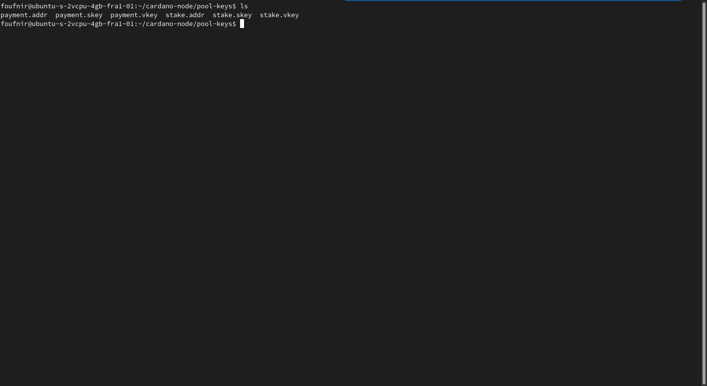
### Funding our wallet

In order to register our stake address, register our stakepool, as well as pay for all the transaction fees, we are going to need some ADA.

**6.04** In the *pool-keys* folder, execute the following command:

```jsx
cat payment.addr
```

:::note
If the address doesn't display well, feel free to execute the following command to have display it in another way:
```jsx
more payment.addr
```
:::
The address the Terminal gave you, is your address. That's where you will need to send the funds.

:::note How much do I need to send?

At least **550 ADA**. This will cover the pool registration, the stake address registration and all the transaction fees for quite some time.

**However** this does **not** cover the pledge. So if you would like to pledge to your stakepool, you will also need to send that amount to the address stored in the payment.addr file.
:::

**6.05** Get out of the *pool-keys* folder, then edit the *.bashrc* file and add the path to the *node.socket* file to it:
```jsx
cd
```
```jsx
nano .bashrc
```
:::note
Make sure to change *YourUSERNAME* with your username.
:::

```jsx
export CARDANO_NODE_SOCKET_PATH=/home/YourUSERNAME/cardano-node/bp-node/db/node.socket
```
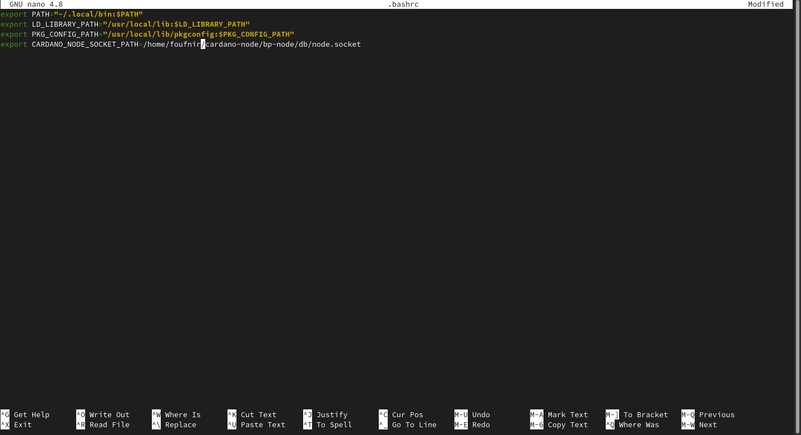
**6.06** Leave the editor, and refresh the *.bashrc* file:

:::note
To leave the editor, save the file with *ctrl + o* and leave with *ctrl + x*.
:::

```jsx
source .bashrc
```

**6.07** Now let's go back to our *pool-keys* folder, and check if the funds arrived in our wallet:
```jsx
cd cardano-node/pool-keys
```
```jsx
cardano-cli shelley query utxo --address $(cat payment.addr) --mainnet
```
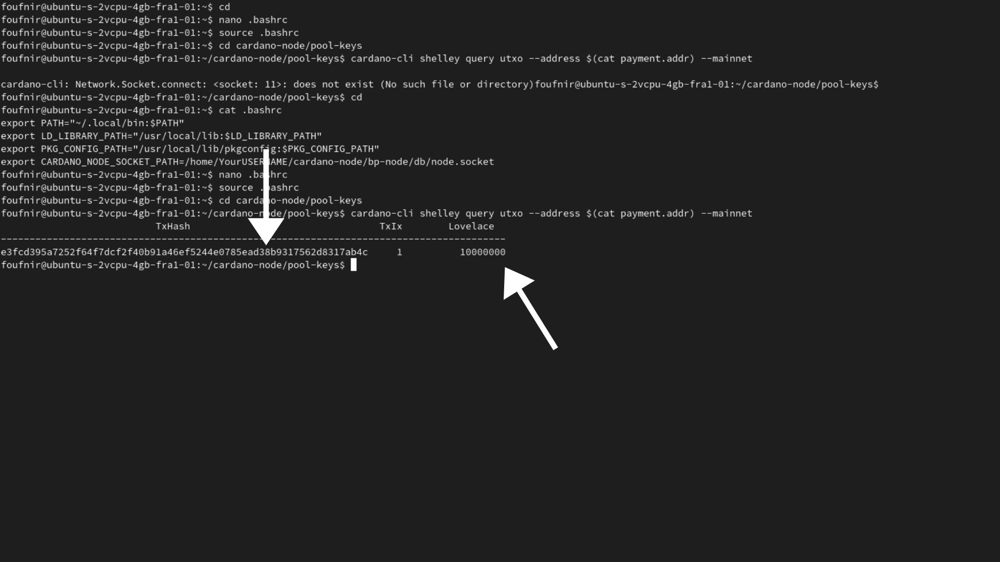
Indicated by the left arrow, you can see your UTxO address, and indicated by the arrow on the right, is the amount of ADA in my wallet, in Lovelaces. In the middle, you can see the amount of transactions made to the UTxO.
:::note
You may have seen I only deposited 10 ADA, and not the 550 ADA I was talking about previously during this guide. This is because I will actually not be registering the stakepool, because 550 ADA is already worth more than 50$ at the time of writing this. However, no worries, you will have the exact same experience as if I was also registering it.
:::

### Registering our stake address on the blockchain

We have now created plenty of addresses, but what we need now, is to register our stake address, so it's *official*.

**6.08** First, let's fetch the protocol parameters from the network:
```jsx
cardano-cli shelley query protocol-parameters --mainnet --out-file protocol.json
```
**6.09** Create the registration certificate:

```jsx
cardano-cli shelley stake-address registration-certificate --stake-verification-key-file stake.vkey --out-file stake.cert
```

**6.10** Now let's first calculate the fees, so we can ensure the transaction is made correctly:
:::note
Make sure to replace *YourOwnUTxO* with the UTxO address you received in step **6.07**, and *TheNumberOfTransactionsMadeTotheUTxO* with the number which was on the right of your UTxO address after having executed step **6.07**'s command. Leave the hashtag in between!

For example, I will be executing the following command:
```jsx
cardano-cli shelley transaction build-raw --tx-in e3fcd395a7252f64f7dcf2f40b91a46ef5244e0785ead38b9317562d8317ab4c#1 --tx-out $(cat payment.addr)+0 --ttl 0 --fee 0 --out-file tx.raw --certificate-file stake.cert
```
:::
```jsx
cardano-cli shelley transaction build-raw --tx-in YourOwnUTxO#TheNumberOfTransactionsMadeTotheUTxO --tx-out $(cat payment.addr)+0 --ttl 0 --fee 0 --out-file tx.raw --certificate-file stake.cert
```
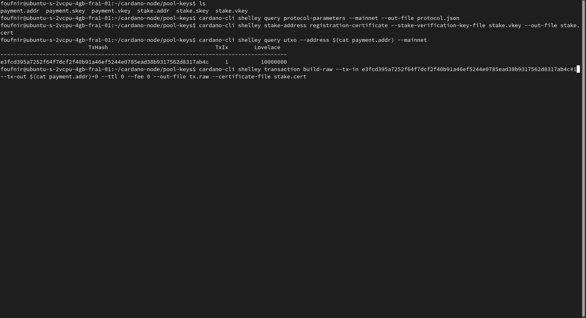
```jsx
cardano-cli shelley transaction calculate-min-fee --tx-body-file tx.raw --tx-in-count 1 --tx-out-count 1 --witness-count 1 --byron-witness-count 0 --mainnet --protocol-params-file protocol.json
```
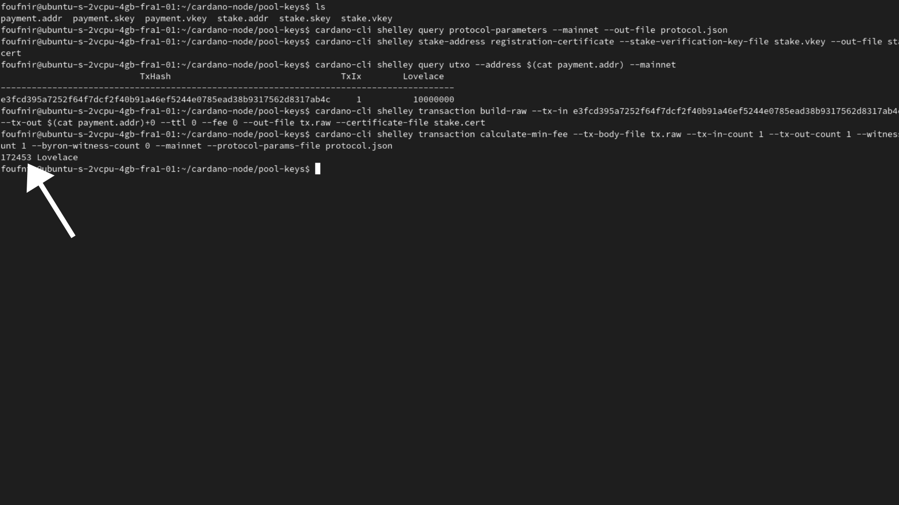

Like you can see on the picture above, the fee **in my case** is 172453 Lovelaces, so nearly one fifth of an ADA. This can, and will likely be different for you. So make sure to double check the fees when executing the following commands.

**6.11** Now let's check the *protocol.json* file, to see how much we need to deposit in our staking wallet:
```jsx
cat protocol.json
```

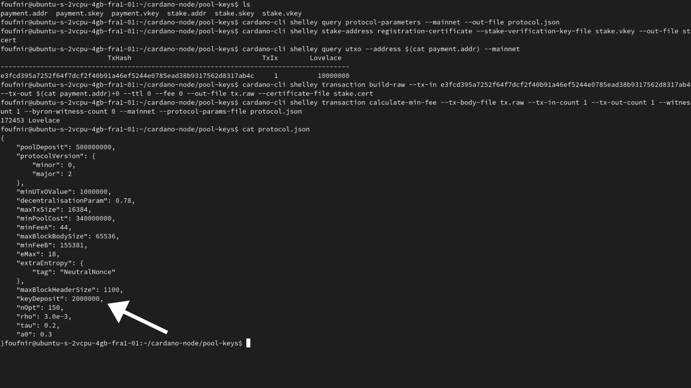

Like you can see on the picture above, the minimum deposit for my staking wallet represents **in my case** 2000000 Lovelaces, or exactly 2 ADA. This can, and will likely be different for you. So make sure to double check the fees when executing the following commands.

:::caution Are you delegating to POA?
If not, please do. It's the only way we generate funds, which we can afterwards use to invest in our activities in Africa to get Cardano adopted there, but also to create more of the guides like the one you are currently using to create your stakepool.

Our ticker is **[POA](https://adapools.org/pool/683e89fa1bcde139504b11fbfd914f8ebe9b8db2678b3da0abdcb2f1)**. You know what to do.

**Make the difference. #StakeWithAfrica**
:::


**6.12** It's math time! Let's calculate how much we need to pay back our own UTxO for the stake address registration:
:::note
- Make sure to replace *TheAmountOfLovelacesInYourUTxO* with the amount in Lovelaces you have in your wallet. If you don't know how much that is anymore, you can find it out with the following command:
```jsx
cardano-cli shelley query utxo --address $(cat payment.addr) --mainnet
```
- Replace *TheFeeWeCalculatedInStep6Dot10* With the fee in Lovelaces we calculated in step **6.10**.

- Finally, replace *TheValueForKeyDepositInYourProtocolDotJsonFile*, with the value you found in your *protocol.json* file during step **6.11**.

In my case, this is my calculation:
```jsx
expr 10000000 - 172453 - 2000000
```
:::

```jsx
expr TheAmountOfLovelacesInYourUTxO - TheFeeWeCalculatedInStep6Dot10 - TheValueForKeyDepositInYourProtocolDotJsonFile
```
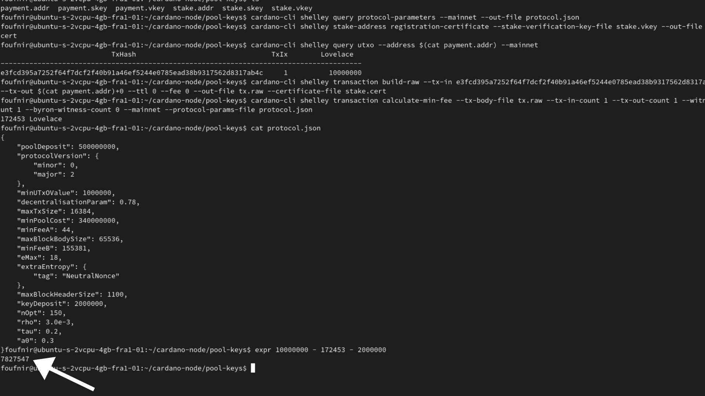

Like you can see on the picture above, I will need to pay back 7827547 Lovelaces, or nearly 8 ADA to my own UTxO.

**6.13** Now let's some more math, by calculating the TTL:
:::note
The TTL, or Time To Live, is the slot height limit for our transaction to be included in a block, if it is not in a block by that slot the transaction will be cancelled.
:::
```jsx
cardano-cli shelley query tip --mainnet
```
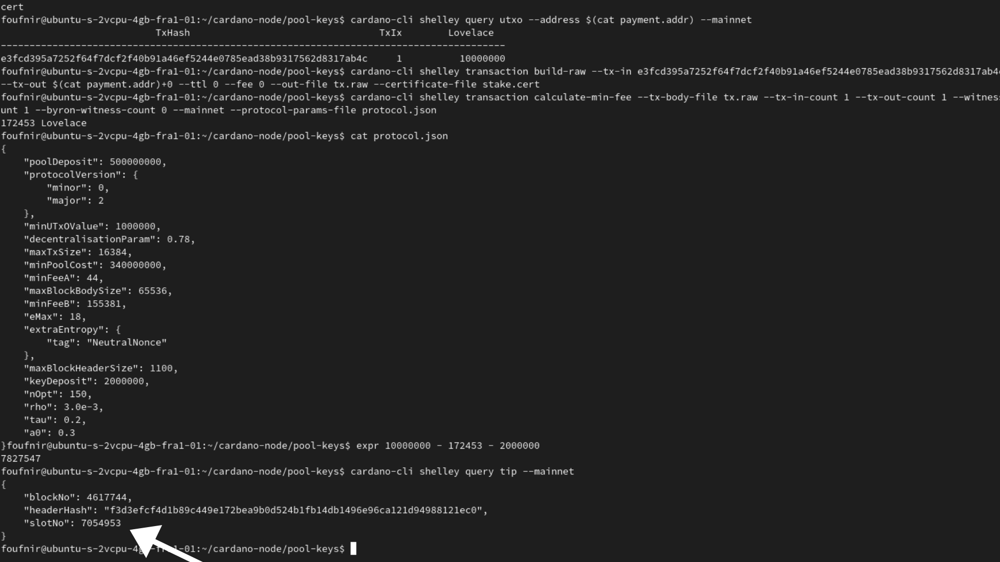

On the picture, you can see I indicated the slot number. This is **not** the TTL. To calculate our TTL, we are going to add 200, to the slot number value.

**6.14** Execute the following command to calculate the TTL
:::note
Make sure to replace *YourSlotNumberValue* with the value for *slotNo* you found in step **6.13**.

In my case, this is my calculation:

```jsx
expr 7054953 + 1000
```
:::
:::note
Starting the moment you calculate the TTL, don't take a coffee break, as the chain is moving fast, and if you take too much time to execute the command, your TTL will be expired and you will need to start over. If you know you are going to take a bit more time than the average person to execute the following commands, feel free to add an extra 1000 to your slot number value.
:::
```jsx
expr YourSlotNumberValue + 1000
```
**6.15** Well, what are you waiting for? Let's actually register our staking address!
:::note
- Make sure to replace *YourOwnUTxO* with your UTxO address. Don't remember, or can't find it? Here is the command:

```jsx
cardano-cli shelley query utxo --address $(cat payment.addr) --mainnet
```
- Replace *TheNumberOfTransactionsMadeTotheUTxO* with the number of transactions made to the UTxO. You can find it by executing the command above. Make sure to leave the hashtag in between!

- Replace TheAmountToPayBackToYourUTxOWeCalculatedInStep6Dot12 with the amount we calculated in step **6.12** to pay back to our own UTxO.

- Replace TheFeeWeCalculatedInStep6Dot10 with the transaction fee we calculated in step **6.10**.

In my case, this is the command I'm using:

```jsx
cardano-cli shelley transaction build-raw --tx-in e3fcd395a7252f64f7dcf2f40b91a46ef5244e0785ead38b9317562d8317ab4c#1 --tx-out $(cat payment.addr)+7827547 --ttl 7056825 --fee 172453 --out-file tx.raw --certificate-file stake.cert
```
:::
```jsx
cardano-cli shelley transaction build-raw --tx-in YourOwnUTxO#TheNumberOfTransactionsMadeTotheUTxO --tx-out $(cat payment.addr)+TheAmountToPayBackToYourUTxOWeCalculatedInStep6Dot12 --ttl TheTTLWeCalculatedInStep6Dot14 --fee TheFeeWeCalculatedInStep6Dot10 --out-file tx.raw --certificate-file stake.cert
```

**6.16** Sign the transaction:

```jsx
cardano-cli shelley transaction sign --tx-body-file tx.raw --signing-key-file payment.skey --signing-key-file stake.skey --mainnet --out-file tx.signed
```

**6.17** And submit it!
```jsx
cardano-cli shelley transaction submit --tx-file tx.signed --mainnet
```

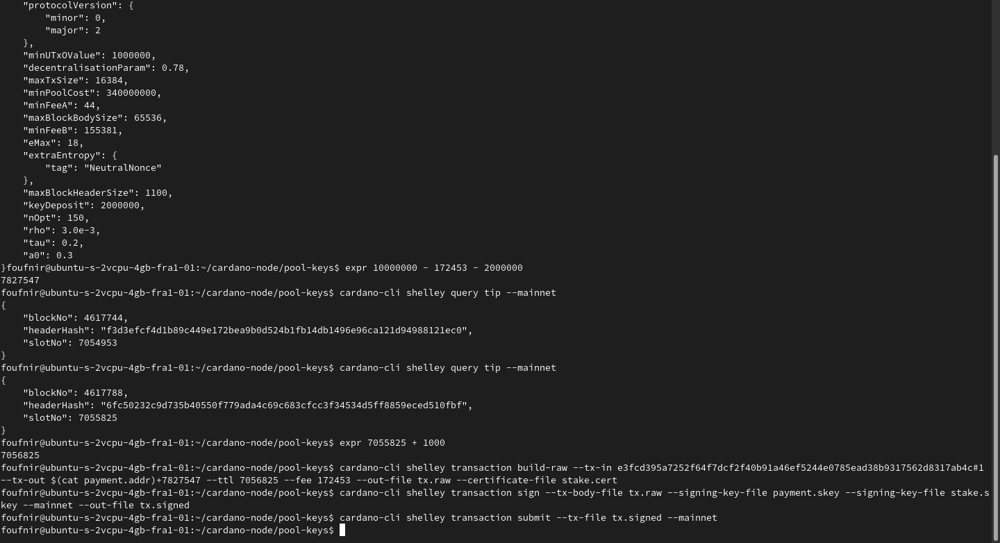

Good job! Your stake address is now officially registerd on-chain!

If you got an error, you likely did something wrong during the transaction creation process. Check your math, make sure you have been using the right commands (and not those I used), and if you really can't find it, feel free to drop a quick message in the **[POA Telegram chat](https://t.me/poapool)**. I will make sure to personally respond to it ASAP!

### Stakepool keys

Now we have generated, and successfully registered our *personal* staking keys, we can now move on to the stakepool keys.

**6.18** Execute the following command in order to generate your cold.vkey, cold.skey and cold.counter files:
```jsx
cardano-cli shelley node key-gen --cold-verification-key-file cold.vkey --cold-signing-key-file cold.skey --operational-certificate-issue-counter-file cold.counter
```

**6.19** Now generate your VRF key pair:
```jsx
cardano-cli shelley node key-gen-VRF --verification-key-file vrf.vkey --signing-key-file vrf.skey
```

**6.20** Generate your KES key pair:
```jsx
cardano-cli shelley node key-gen-KES --verification-key-file kes.vkey --signing-key-file kes.skey
```

**6.21** Check if you have everything:
```jsx
ls
```

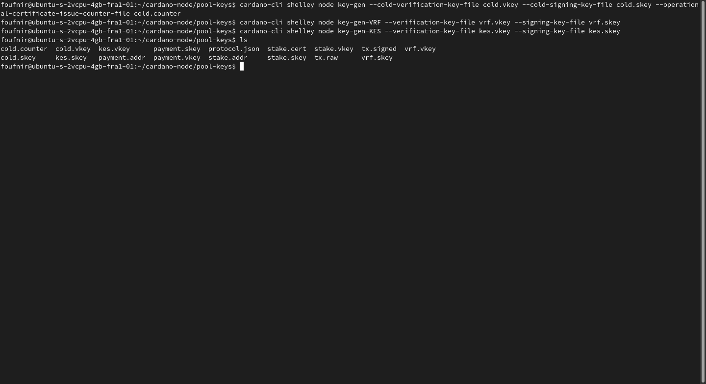

### Generating our *Operational Certificate*

**6.22** First, execute the following command to check the amount of slots per KES period:
:::note
Make sure to replace *YourUSERNAME* with your username.
:::
```jsx
cat /home/YourUSERNAME/cardano-node/bp-node/mainnet-shelley-genesis.json | grep KESPeriod
```
**6.23** Now let's query the mainnet tip:
```jsx
cardano-cli shelley query tip --mainnet
```

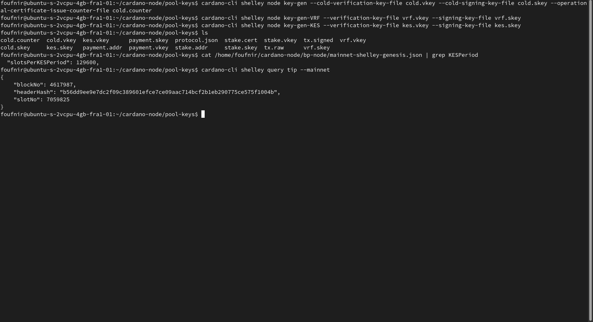

Like you can see on the picture above, the number of slots per period is **in my case** 129600, and the current *slotNo* is 7059825.

**6.24** It's math time (again)! Divide the value of *slotNo* by the *KESPeriod* value we calculated during step **6.21**:

:::note

- Make sure to replace TheSlotNumberYouFoundInStep6Dot22 with the value for *slotNo* you found during step **6.22**.

- Replace TheNumberOfSlotsPerPeriodYouFoundInStep6Dot21 with the value for number of slots per period you found during step **6.21**.

This is the command I will personally be executing:
```jsx
expr 7059825 / 129600
```
:::
```jsx
expr TheSlotNumberYouFoundInStep6Dot22 / TheNumberOfSlotsPerPeriodYouFoundInStep6Dot21
```

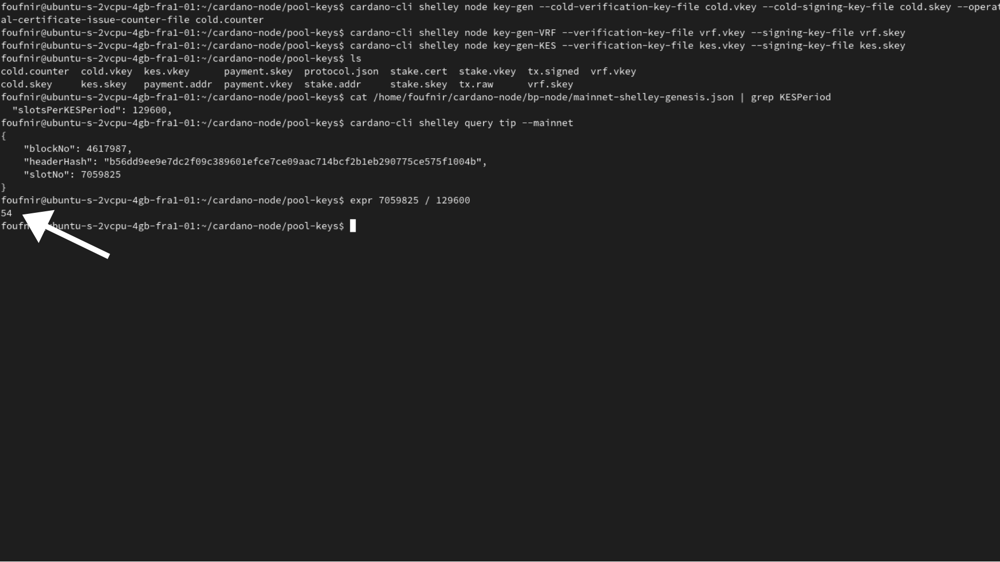

Like you can see on the picture above, the KESPeriod is **in my case** 54. This will likely be different for you. So make sure to double check the this when executing the following command.

**6.25** Generate the certificate!

:::note
Make sure to replace *TheNumberYouFoundForTheKESPeriodInStep6Dot24* with the value you found for the KESPeriod during step **6.24**

This is what the command I will be executing looks like:
```jsx
cardano-cli shelley node issue-op-cert --kes-verification-key-file kes.vkey --cold-signing-key-file cold.skey --operational-certificate-issue-counter cold.counter --kes-period 54 --out-file node.cert
```
:::
```jsx
cardano-cli shelley node issue-op-cert --kes-verification-key-file kes.vkey --cold-signing-key-file cold.skey --operational-certificate-issue-counter cold.counter --kes-period TheNumberYouFoundForTheKESPeriodInStep6Dot24 --out-file node.cert
```

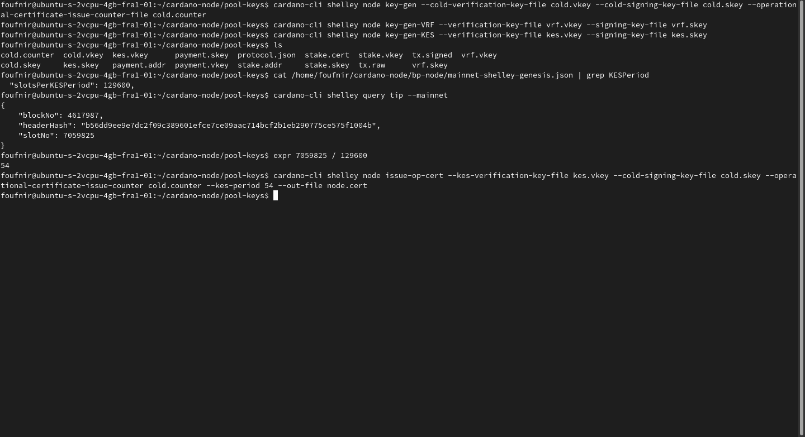

:::note Become part of the POA community!
If you want to meet other builders and global shapers, make sure to join our **[Telegram chat](https://t.me/poapool)**, where most of our community is hanging out. Oh, and if you have a question, you can also ask it there!
:::
