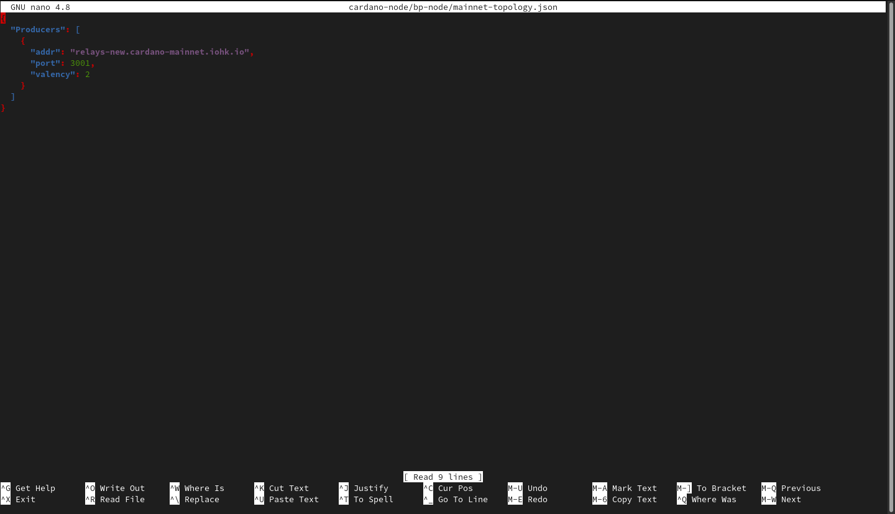
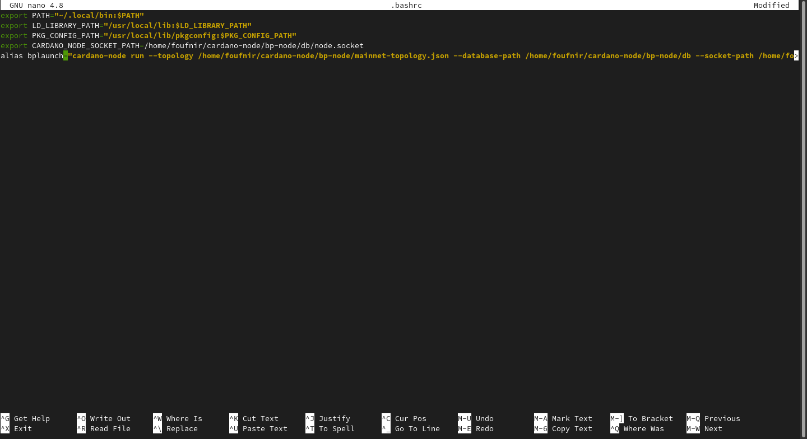

IT'S TIME!!!

Yes! We are now finally going to launch the stakepool. But just before, we need to change some things in the *topology.json* files of our block-producing node, and our relay node.

### Configuring the *topology.json* file on your *bp-node*

The *topology.json* file is for a node, what a map was for Marco Polo. It really is like a map for a node, as it gives all the necessary info for it to reach other nodes. It's **incredibly** important.

**10.01** Log into the VPS of your block-producing node.

**10.02** Execute the following command to modify the *topology.json* file:

```jsx
nano cardano-node/bp-node/mainnet-topology.json
```

You should normally see something like this:



**10.03** Remove everything, and copy paste this instead:

:::note
Replace TheIPaddressOfYourRelayNodeVPS with the IP address of your relay's VPS.
:::

```jsx
{
"Producers": [
  {
    "addr": "TheIPaddressOfYourRelayNodeVPS",
    "port": 3000,
    "valency": 1
  }
]
}
```

**10.04** Save the file, leave the editor, and let's modify the *.bashrc* file to do some magic:

:::note
To go back to the Terminal, press *ctrl+o* to save the file, and *ctrl + x* to quit.
:::

```jsx
nano .bashrc
```

**10.05** Add the following to your *.bashrc* file:

:::note
- Replace *YourUserNameOnYourVPS* with the username you are using on your bp-node's VPS.

- Replace *TheIPaddressOfYourVPS* with the IP address of your bp-node's VPS.

In my case, the command looks like this:

```jsx
alias bplaunch="cardano-node run --topology /home/foufnir/cardano-node/bp-node/mainnet-topology.json --database-path /home/foufnir/cardano-node/bp-node/db --socket-path /home/foufnir/cardano-node/bp-node/db/node.socket --host-addr I'm-Not-Giving-You-The-IP --port 3000 --config /home/foufnir/cardano-node/bp-node/mainnet-config.json --shelley-kes-key /home/foufnir/cardano-node/pool-keys/kes.skey --shelley-vrf-key /home/foufnir/cardano-node/pool-keys/vrf.skey --shelley-operational-certificate /home/foufnir/cardano-node/pool-keys/node.cert"
```
:::

```jsx
alias bplaunch="cardano-node run --topology /home/YourUserNameOnYourVPS/cardano-node/bp-node/mainnet-topology.json --database-path /home/YourUserNameOnYourVPS/cardano-node/bp-node/db --socket-path /home/YourUserNameOnYourVPS/cardano-node/bp-node/db/node.socket --host-addr TheIPaddressOfYourVPS --port 3000 --config /home/YourUserNameOnYourVPS/cardano-node/bp-node/mainnet-config.json --shelley-kes-key /home/YourUserNameOnYourVPS/cardano-node/pool-keys/kes.skey --shelley-vrf-key /home/YourUserNameOnYourVPS/cardano-node/pool-keys/vrf.skey --shelley-operational-certificate /home/YourUserNameOnYourVPS/cardano-node/pool-keys/node.cert"
```



**10.06** Save the file, leave the editor, and refresh the *.bashrc* file:

:::note
To go back to the Terminal, save the file with *ctrl + o*, and leave the editor with *ctrl + x*.
:::

```jsx
source .bashrc
```

**10.07** Time to launch the *bp-node*! Execute the following command:

```jsx
bplaunch
```

Boom! Magic. You should now see your node launching.

Though, we still need to configure the relay node to interact with the *bp-node*.

:::caution Are you delegating to POA?
If not, please do. It's the only way we generate funds, which we can afterwards use to invest in our activities in Africa to get Cardano adopted there, but also to create more of the guides like the one you are currently using to create your stakepool.

Our ticker is **[POA](https://adapools.org/pool/683e89fa1bcde139504b11fbfd914f8ebe9b8db2678b3da0abdcb2f1)**. You know what to do.

**Make the difference. #StakeWithAfrica**
:::

### Configuring the *topology.json* file on your *relay-node*

**10.08** Log into the VPS of your relay-node node.

**10.02** Execute the following command to modify the *topology.json* file:

:::note
Due to the fact you used the same guide to create the *relay-node*, you have likely called the relay's folder *bp-node*. If you want, you can modify its name for better clarity, however, you will also then have to modify every time the name of the folder in the following commands.
:::

```jsx
nano cardano-node/bp-node/mainnet-topology.json
```

You should normally see something like this:


**10.03** Remove everything, and copy paste this instead:

:::note
Replace TheIPaddressOfYourBlockProducingNodeVPS with the IP address of your bp-node's VPS.
:::

```jsx
{
"Producers": [
  {
  "addr": "relays-new.cardano-mainnet.iohk.io",
  "port": 3001,
  "valency": 2
  },
  {
    "addr": "TheIPaddressOfYourBlockProducingNodeVPS",
    "port": 3000,
    "valency": 1
  }
]
}
```

**10.04** Save the file, leave the editor, and let's modify the *.bashrc* file to do some magic:

:::note
To go back to the Terminal, press *ctrl+o* to save the file, and *ctrl + x* to quit.
:::

```jsx
nano .bashrc
```

**10.05** Add the following to your *.bashrc* file:

:::note
- Replace *YourUserNameOnYourVPS* with the username you are using on your relay-node's VPS.

- Replace *TheIPaddressOfYourVPS* with the IP address of your relay-node's VPS.

In my case, the command looks like this:

```jsx
alias relaylaunch="cardano-node run --topology /home/foufnir/cardano-node/bp-node/mainnet-topology.json --database-path /home/foufnir/cardano-node/bp-node/db --socket-path /home/foufnir/cardano-node/bp-node/db/node.socket --host-addr I'm-Not-Giving-You-The-IP --port 3000 --config /home/foufnir/cardano-node/bp-node/mainnet-config.json"
```
:::

```jsx
alias relaylaunch="cardano-node run --topology /home/YourUserNameOnYourVPS/cardano-node/bp-node/mainnet-topology.json --database-path /home/YourUserNameOnYourVPS/cardano-node/bp-node/db --socket-path /home/YourUserNameOnYourVPS/cardano-node/bp-node/db/node.socket --host-addr TheIPaddressOfYourVPS --port 3000 --config /home/YourUserNameOnYourVPS/cardano-node/bp-node/mainnet-config.json"
```

**10.06** Save the file, leave the editor, and refresh the *.bashrc* file:

:::note
To go back to the Terminal, save the file with *ctrl + o*, and leave the editor with *ctrl + x*.
:::

```jsx
source .bashrc
```

**10.07** Time to launch the *relay-node*! Execute the following command:

```jsx
relaylaunch
```

Boom! Magic. You should now see your node launching.

:::note Become part of the POA community!
If you want to meet other builders and global shapers, make sure to join our **[Telegram chat](https://t.me/poapool)**, where most of our community is hanging out. Oh, and if you have a question, you can also ask it there!
:::
