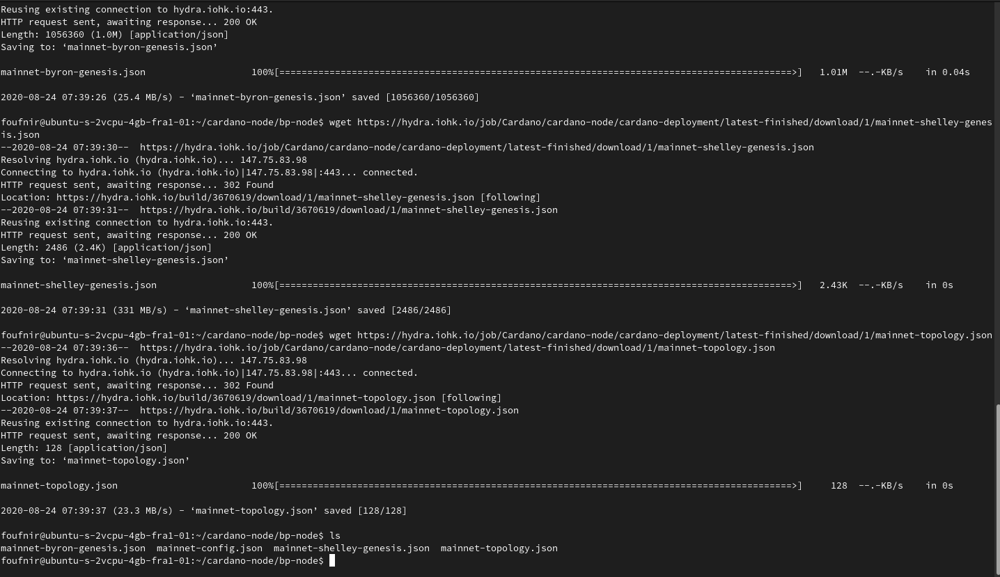
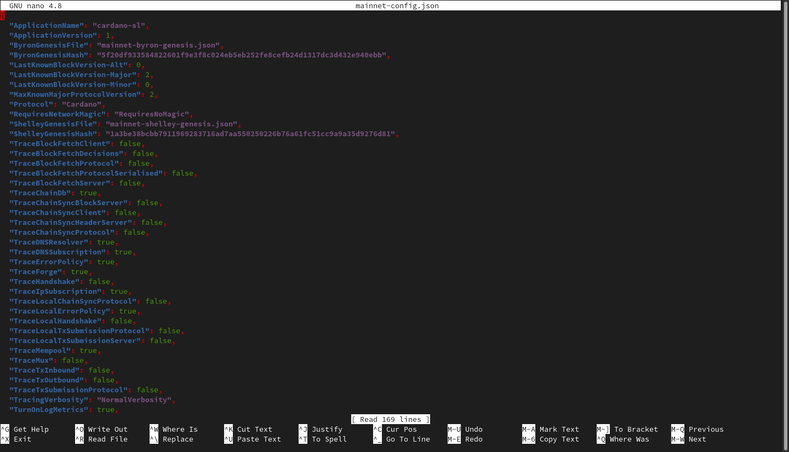
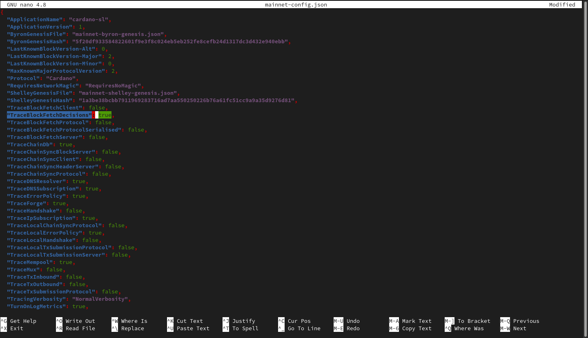
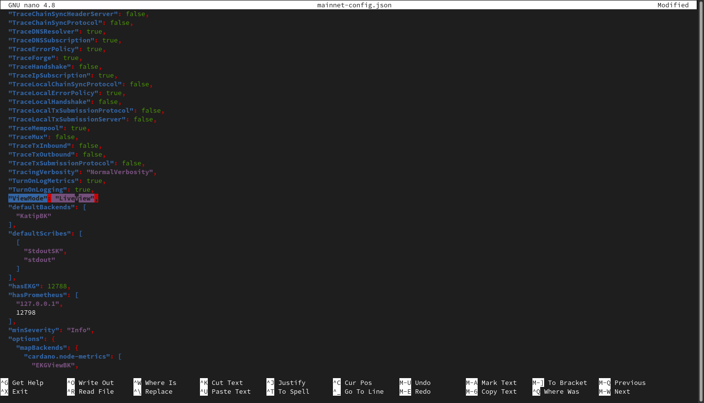
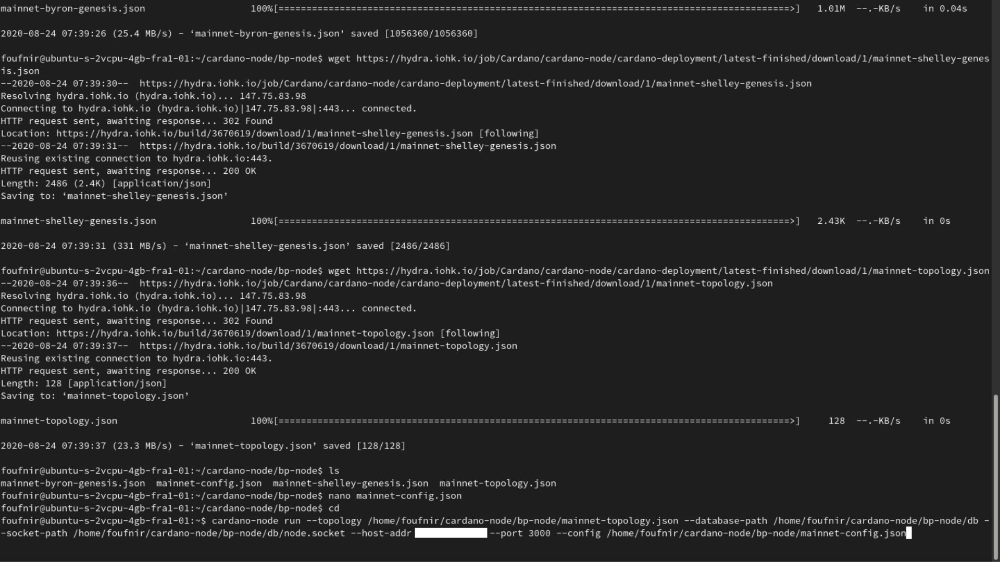
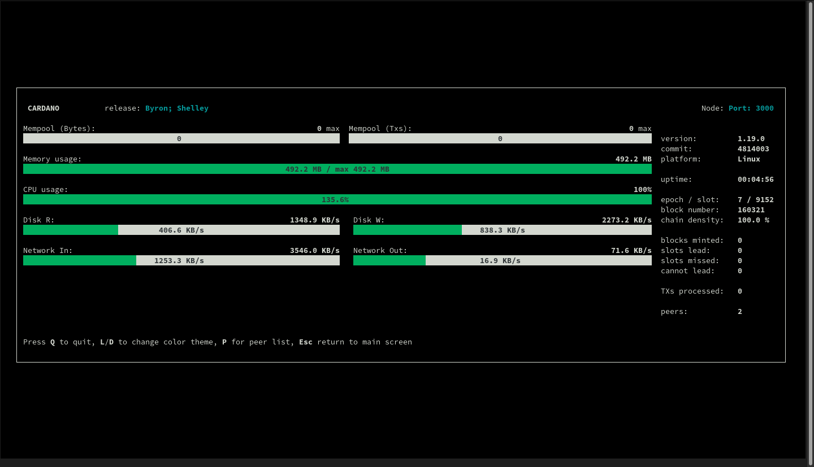
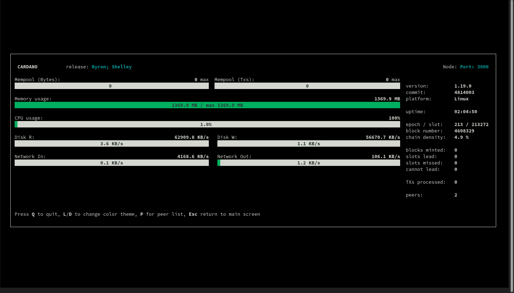

After setting up our node, it's now time to launch it. But first, we will need to download the configuration files, and make some little changes to ensure everything is running correctly.

### Downloading and setting up the configuration files

**5.01** First, let's create a folder for our node, inside the *cardano-node* directory:
```jsx
cd
```
```jsx
cd cardano-node
```
```jsx
mkdir bp-node
```
```jsx
cd bp-node
```
**5.02** You are now in the *bp-node* folder, which the block-producing node will be using. Execute the following commands to download the necessary configuration files:
```jsx
wget https://hydra.iohk.io/job/Cardano/cardano-node/cardano-deployment/latest-finished/download/1/mainnet-config.json
```
```jsx
wget https://hydra.iohk.io/job/Cardano/cardano-node/cardano-deployment/latest-finished/download/1/mainnet-byron-genesis.json
```
```jsx
wget https://hydra.iohk.io/job/Cardano/cardano-node/cardano-deployment/latest-finished/download/1/mainnet-shelley-genesis.json
```
```jsx
wget https://hydra.iohk.io/job/Cardano/cardano-node/cardano-deployment/latest-finished/download/1/mainnet-topology.json
```
**5.03** Now execute the *ls* command to check if you have downloaded all the files:
```jsx
ls
```


:::caution Are you delegating to POA?
If not, please do. It's the only way we generate funds, which we can afterwards use to invest in our activities in Africa to get Cardano adopted there, but also to create more of the guides like the one you are currently using to create your stakepool.

Our ticker is **[POA](https://adapools.org/pool/683e89fa1bcde139504b11fbfd914f8ebe9b8db2678b3da0abdcb2f1)**. You know what to do.

**Make the difference. #StakeWithAfrica**
:::

**5.03** OK. We have now all the necessary configuration files, but let's just make a few modifications to the *mainnet-config.json* file:
```jsx
nano mainnet-config.json
```
**5.04** Change *TraceBlockFetchDecisions* from *false* to *true*. Scroll down, then change *ViewMode* from *SimpleView* to *LiveView*:





**5.05** Save the file, and execute the following command to get out of any directory you may be in:

:::note
To go back to the terminal, save the file with *ctrl + o*, and leave the editor with *ctrl + x*.
:::

```jsx
cd
```

### Launching our first node

**5.06** The following command is the one you will be using to launch your node. Before executing it into the terminal, make sure to change **everywhere** *YourUSERNAME* with your username on the VPS, as well as change *TheIPaddressOfYourVPS* with the IP address of your VPS.

:::note
You may need to execute the following command before executing the node launch command, as otherwise, the system will not know where the *cardano-node* executable is.

```jsx
source .bashrc
```
:::

```jsx
cardano-node run --topology /home/YourUSERNAME/cardano-node/bp-node/mainnet-topology.json --database-path /home/YourUSERNAME/cardano-node/bp-node/db --socket-path /home/YourUSERNAME/cardano-node/bp-node/db/node.socket --host-addr TheIPaddressOfYourVPS --port 3000 --config /home/YourUSERNAME/cardano-node/bp-node/mainnet-config.json
```




Your node is is now syncing with the blockchain. This is going to take some time. Wait until the value for *epoch / slot* on the dashboard reaches the epoch and slot available on [PoolTool](https://pooltool.io). When that's the case, your node will be fully synchronized with the blockchain.



:::note Become part of the POA community!
If you want to meet other builders and global shapers, make sure to join our **[Telegram chat](https://t.me/poapool)**, where most of our community is hanging out. Oh, and if you have a question, you can also ask it there!
:::
