In this fourth part of the guide, we will be installing the node from source, and setting up the configuration files so you can immediately start running it.

### Downloading and setting up Cabal

To set up our nodes, we will need the Cabal Library, which we will be using to build our nodes.

**4.01** Execute the following command in order to download Cabal:
```jsx
wget https://downloads.haskell.org/~cabal/cabal-install-3.2.0.0/cabal-install-3.2.0.0-x86_64-unknown-linux.tar.xz
```

**4.02** Unpack it:
```jsx
tar -xf cabal-install-3.2.0.0-x86_64-unknown-linux.tar.xz
```

**4.03** Delete the downloaded file, as now we have unpacked it, we don't need it anymore:
```jsx
rm cabal-install-3.2.0.0-x86_64-unknown-linux.tar.xz cabal.sig
```

**4.04** Now create the .local/bin folder, where we still store Cabal:
```jsx
mkdir -p ~/.local/bin
```

**4.05** Move Cabal to the new .local/bin folder:
```jsx
mv cabal ~/.local/bin/
```

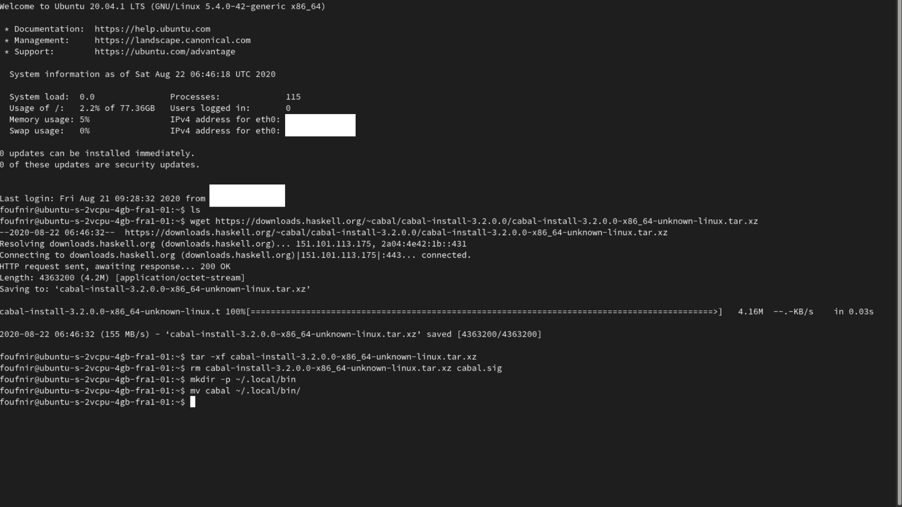

**4.06** Add the line of code (with "export") to your .bashrc file to add .local/bin folder to your PATH:
```jsx
nano .bashrc
```
```jsx
export PATH="~/.local/bin:$PATH"
```
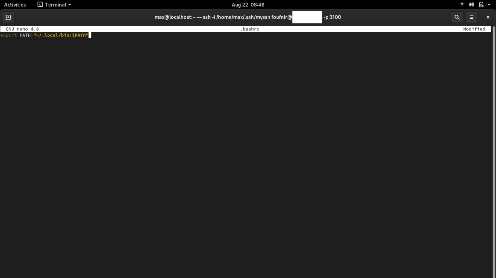

**4.07** Leave the file, and refresh it:

:::note
To leave the editor, save the file with *ctrl + o*, and leave the editor with *ctrl + x*.
:::

```jsx
source .bashrc
```

**4.08** Update Cabal:
```jsx
cabal update
```

**4.09** And finally, check if you have the right version:
```jsx
cabal --version
```

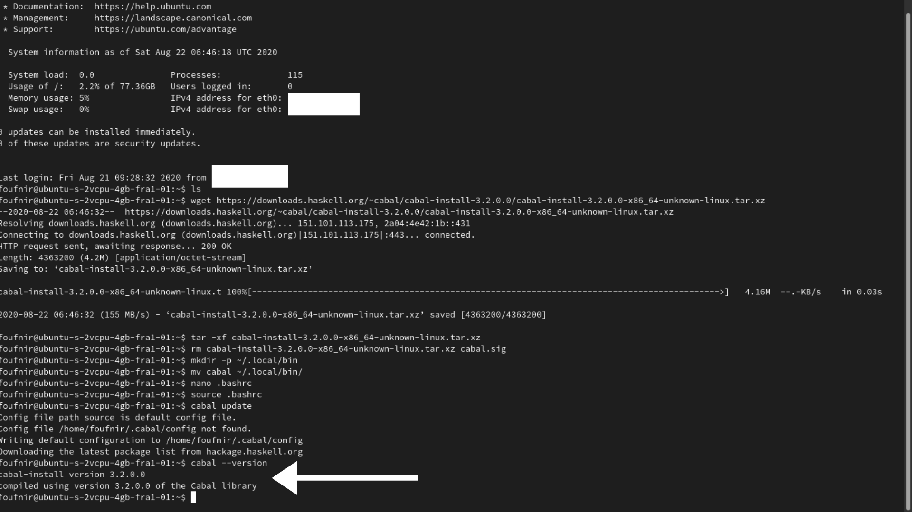

### Downloading and setting up GHC

The Glasgow Haskell Compiler, is like Cabal, a tool which will help us build our nodes.

**4.10** Execute the following command to download the file:
```jsx
wget https://downloads.haskell.org/~ghc/8.6.5/ghc-8.6.5-x86_64-deb9-linux.tar.xz
```

**4.11** Unpack the file:
```jsx
tar -xf ghc-8.6.5-x86_64-deb9-linux.tar.xz
```

**4.12** Delete the initially downloaded file:
```jsx
rm ghc-8.6.5-x86_64-deb9-linux.tar.xz
```

**4.13** Enter the GHC folder:
```jsx
cd ghc-8.6.5
```
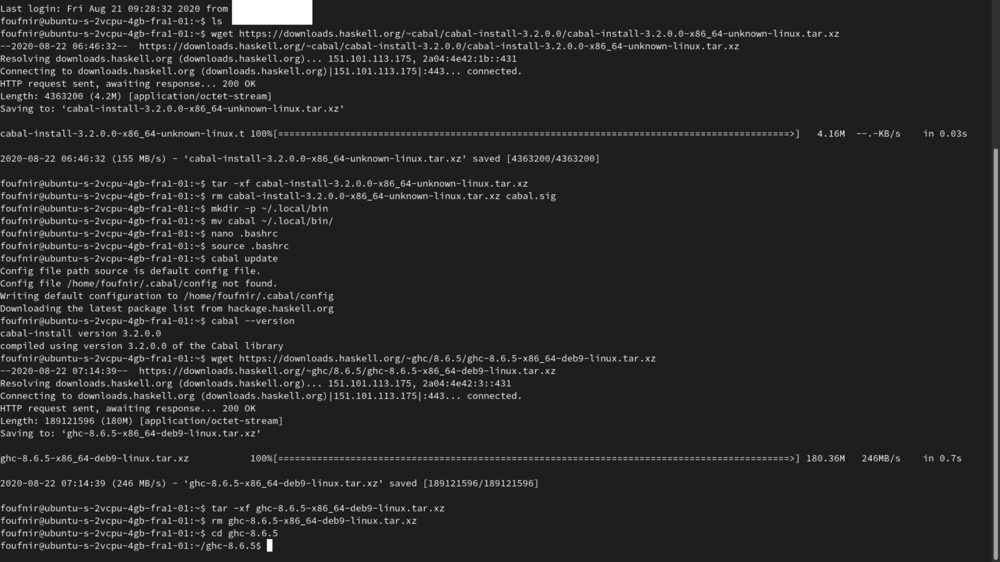

**4.14** Configure it:
```jsx
./configure
```
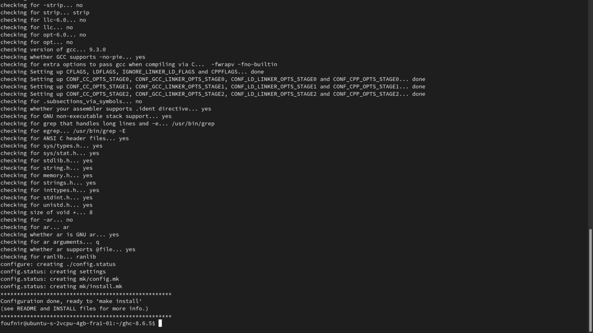

**4.15** And install it:
```jsx
sudo make install
```

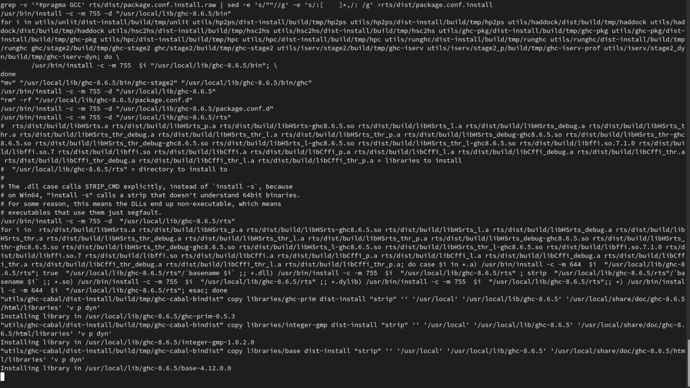

### Downloading and setting up Libsodium

Like GHC and Cabal, Libsodium is a tool which is required to run our nodes.

**4.16** Execute the following command to download the file:
```jsx
git clone https://github.com/input-output-hk/libsodium
```

**4.17** Enter the folder:
```jsx
cd libsodium
```

**4.18** Execute this magic command:
```jsx
git checkout 66f017f1
```
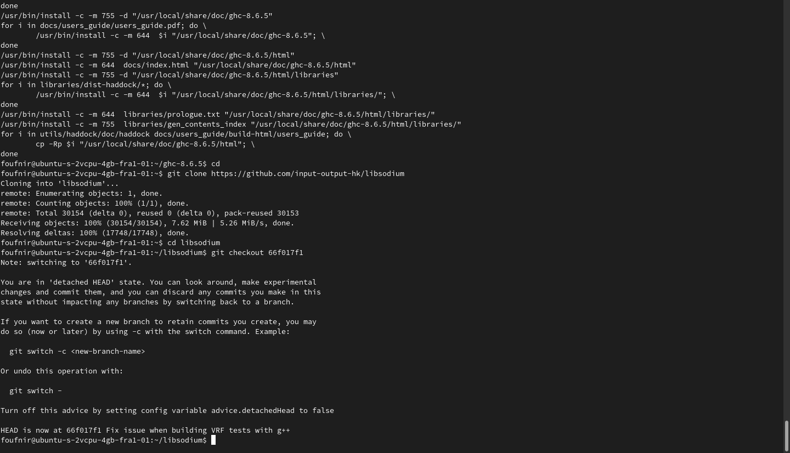

**4.19** Configure it:
```jsx
./autogen.sh
```
```jsx
./configure
```

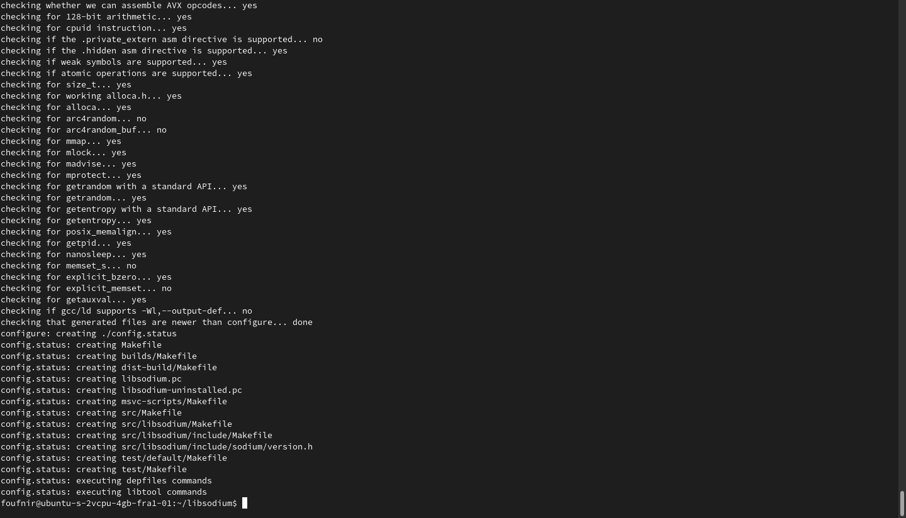

:::caution Are you delegating to POA?
If not, please do. It's the only way we generate funds, which we can afterwards use to invest in our activities in Africa to get Cardano adopted there, but also to create more of the guides like the one you are currently using to create your stakepool.

Our ticker is **[POA](https://adapools.org/pool/683e89fa1bcde139504b11fbfd914f8ebe9b8db2678b3da0abdcb2f1)**. You know what to do.

**Make the difference. #StakeWithAfrica**
:::

**4.20** And install it:
```jsx
make
```

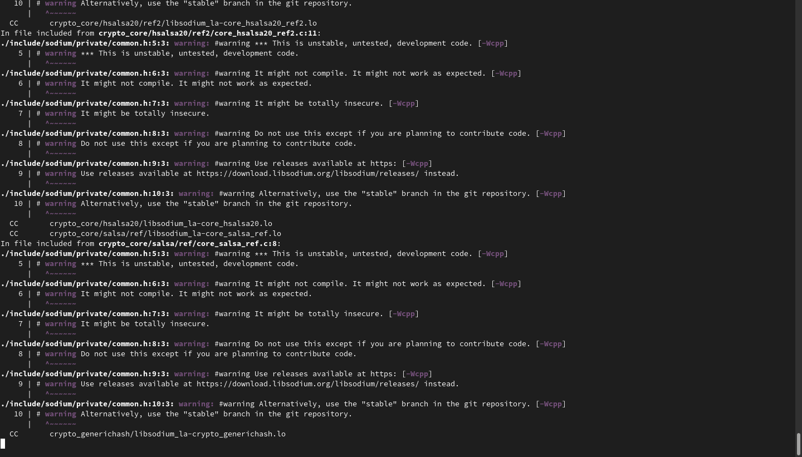

```jsx
sudo make install
```

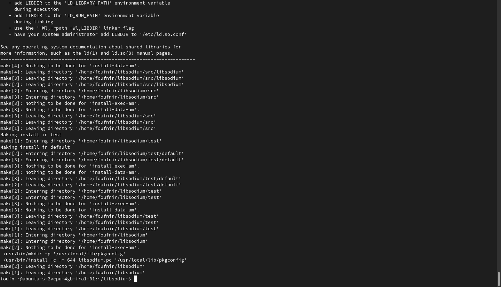

**4.21** Leave the folder, edit the .bashrc file, and add the two lines of code (with "export") to it:
```jsx
cd
```
```jsx
nano .bashrc
```

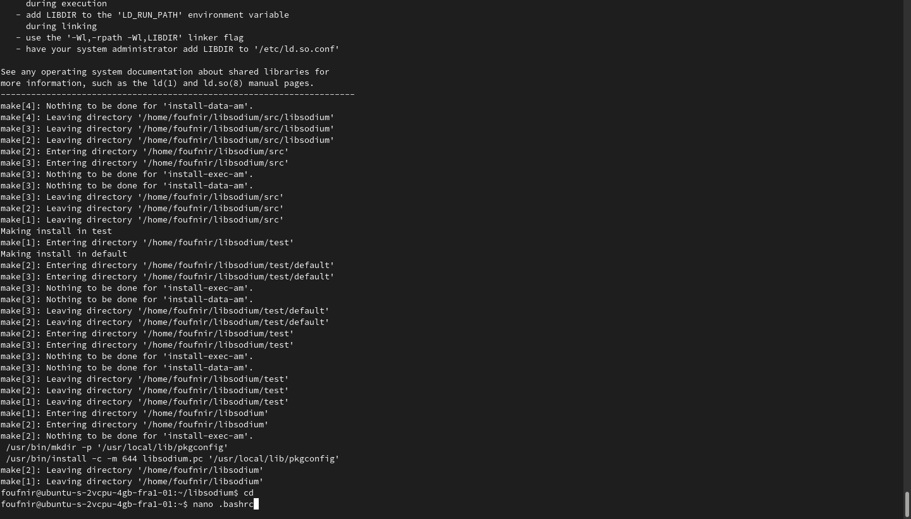

```jsx
export LD_LIBRARY_PATH="/usr/local/lib:$LD_LIBRARY_PATH"
export PKG_CONFIG_PATH="/usr/local/lib/pkgconfig:$PKG_CONFIG_PATH"
```

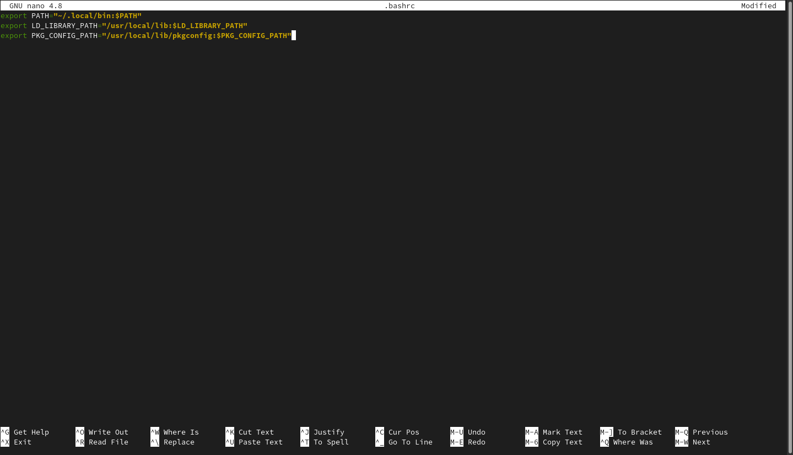

:::note
To leave the editor, save the file with *ctrl + o* and quit with *ctrl + x*.
:::

### Downloading and setting up cardano-node

In this part, we will now be download the source code of cardano-node, the Cardano node software, and setting it up through the use of Cabal.

**4.22** Execute the following command to download the file:

```jsx
git clone https://github.com/input-output-hk/cardano-node.git
```

**4.23** Enter the file with the following command:

```jsx
cd cardano-node
```

**4.24** Fetch all the possible versions, and then list them:

```jsx
git fetch --all --tags
```

```jsx
git tag
```

**4.25** Execute the following command to select the version you would like to use:

:::note
To know which the latest version is, check **[this page](https://github.com/input-output-hk/cardano-node/releases)** and see which version is at the top.
:::

```jsx
git checkout tags/TheVersionYouWouldLikeToUse
```

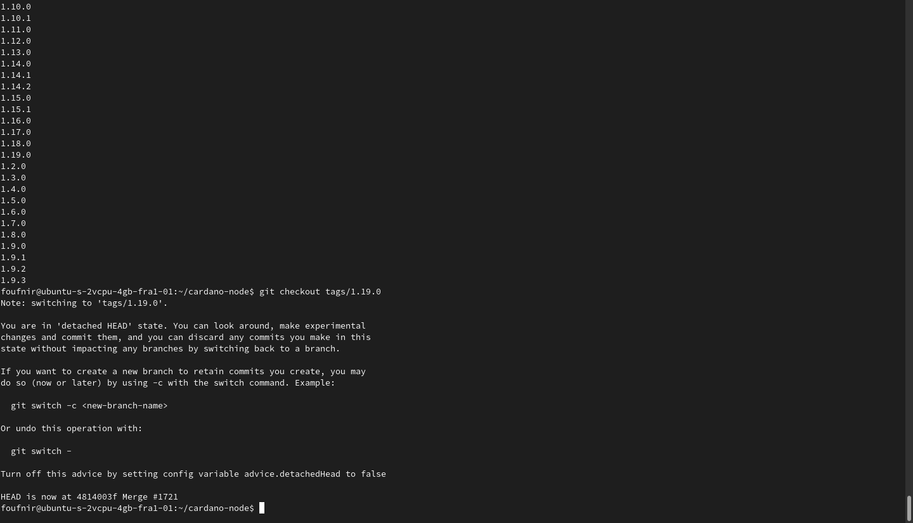

:::note
Like you can see, I will be using cardano-node 1.19.0 as that's the latest version at the time of writing this. Though, make sure to use the latest version when you are doing this, by checking the latest version like explained above.
:::

**4.26** Prepare a book (this command will take a long time to process), and execute the following command:

```jsx
cabal build all
```

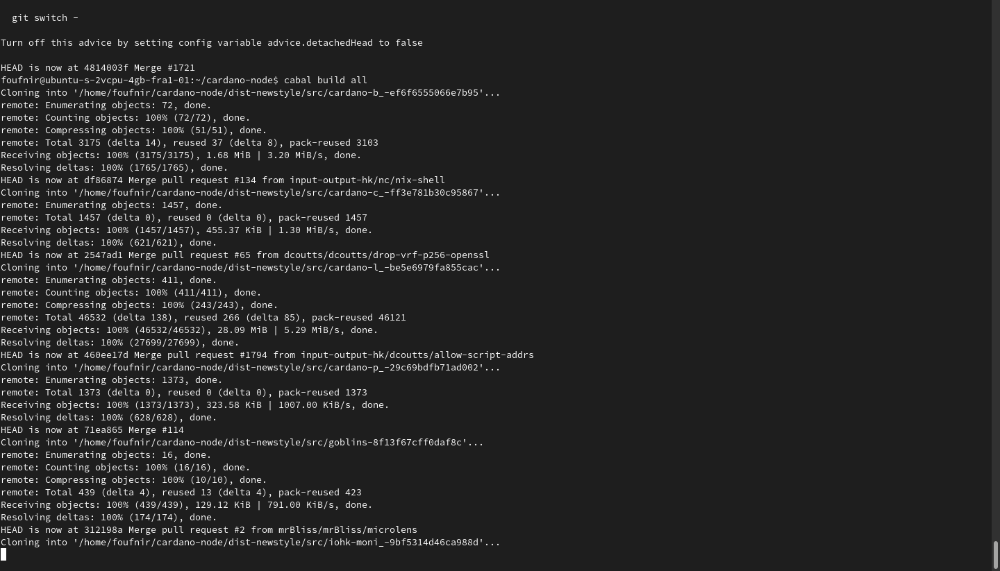
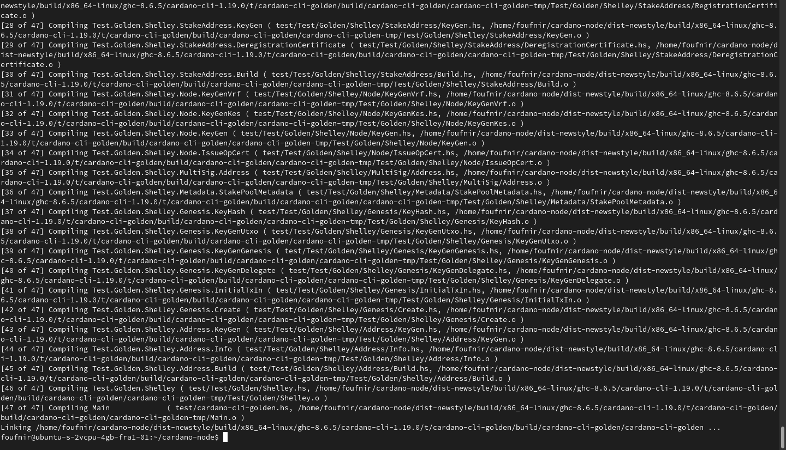

**4.27** Now execute the following commands to move the cardano-node and cardano-cli executables to the .local/bin folder:

:::note
Make sure to replace "TheVersionYouWouldLikeToUse" in the following commmands with the version you selected at step **4.25**.
:::

```jsx
cp -p dist-newstyle/build/x86_64-linux/ghc-8.6.5/cardano-node-TheVersionYouWouldLikeToUse/x/cardano-node/build/cardano-node/cardano-node ~/.local/bin/
```

```jsx
cp -p dist-newstyle/build/x86_64-linux/ghc-8.6.5/cardano-cli-TheVersionYouWouldLikeToUse/x/cardano-cli/build/cardano-cli/cardano-cli ~/.local/bin/
```

**4.28** Finally, check if you have the right version:

```jsx
cardano-cli --version
```
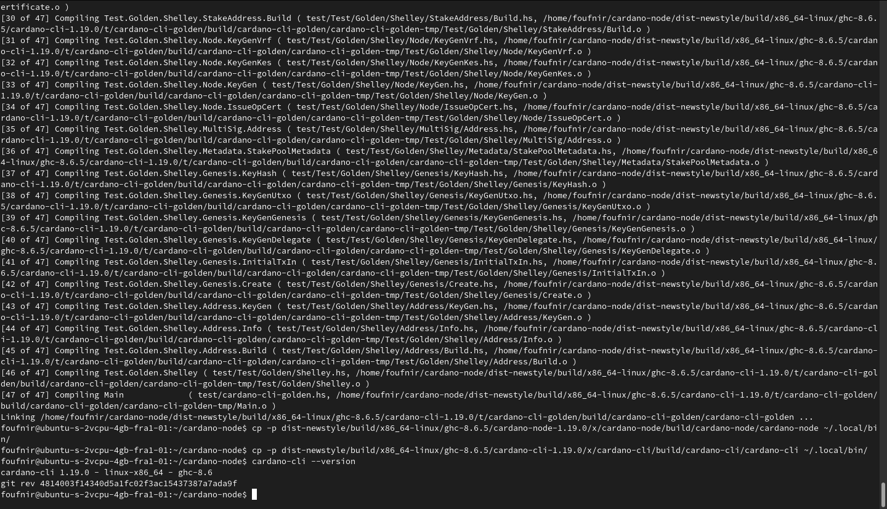

Good job! You can now head over to step 5 of the POA Stakepool Mainnet Guide, where you will finally be launching the nodes.

:::note Become part of the POA community!
If you want to meet other builders and global shapers, make sure to join our **[Telegram chat](https://t.me/poapool)**, where most of our community is hanging out. Oh, and if you have a question, you can also ask it there!
:::
