In this third part of the POA Stakepool Mainnet Guide, we will be configuring our first server. This means we will be installing the required packages, creating a non-root user, as well as setting up firewalls to protect our block-producing node.

:::note
From now on, **everything** (unless mentioned otherwise) will be happening on your VPS.
:::


### Creating a new user

We are currently logged in our server as "root". Root is a user which has all the admin privileges, consider it like the dictator position. Having the ability to become a dictator shouldn't exist, well, it's the exact same thing with the root user. Why? Because if someone is able to access the root user, he will have the ability to control the whole server, as the root user has all the admin privileges.

This is the reason why we will only be using "root" temporarily, in order to configure our server, but afterwards, we will be moving over to the user we are now going to create.

**3.01** Create a new user with the following command:
:::note
Everytime you see "YourUserName", remove it, and replace it with the username you would like to use. In my case, this will be "foufnir".
:::
```jsx
useradd YourUserName && passwd YourUserName
```
**3.02** Now, we need to add this user in the "sudo group", so he too, will be able to have some admin privileges:
```jsx
usermod -aG sudo YourUserName
```
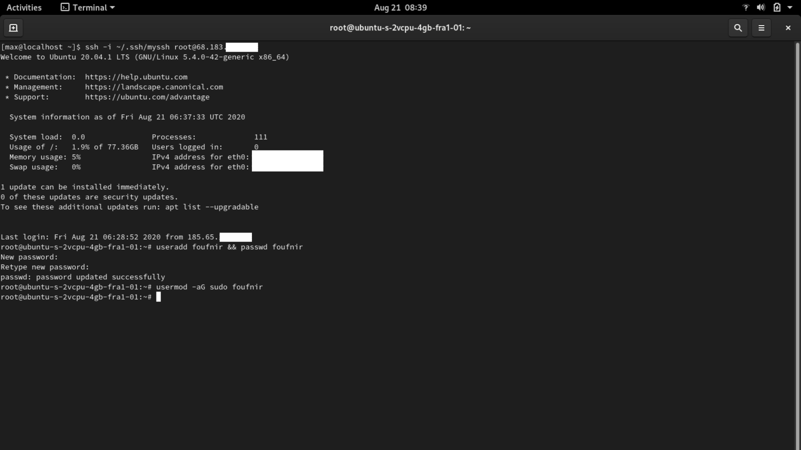

**3.03** Let's change some other privileges
```jsx
sudo visudo
```

:::note
You are now in the "nano" editor. This is an editor in the Terminal which allows you to create and edit files. To quit the editor, first press *ctrl + o* to save, and *ctrl + x* to quit the editor.
:::

**3.04** Now add the following line of code under "User privilege specification":

```jsx
YourUserName ALL=(ALL:ALL) ALL
```

:::note
Make sure to replace "YourUserName", with the username you created at the beginning of this part of the guide.
:::

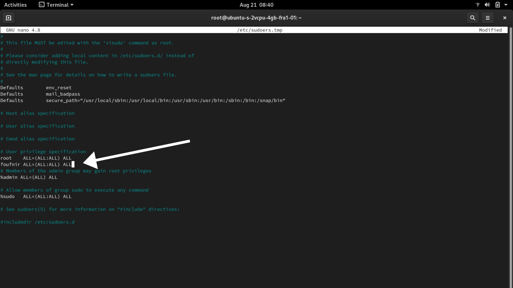

**3.05** Now execute the following commands in the right order, and make sure to always replace YourUserName with your username:

```jsx
mkdir /home/YourUserName
```
```jsx
chown YourUserName:YourUserName /home/YourUserName -R
```
``` jsx
rsync --archive --chown=YourUserName:YourUserName ~/.ssh /home/YourUserName
```
``` jsx
chsh -s /bin/bash YourUserName
```
### Updating, and installing some packages
Now we have created a new user, let's update the OS, as well as install the required packages to run our block-producing node.

``` jsx
apt update -y
```
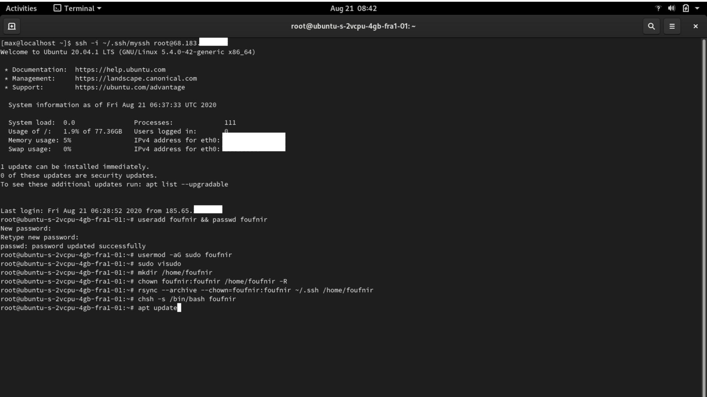

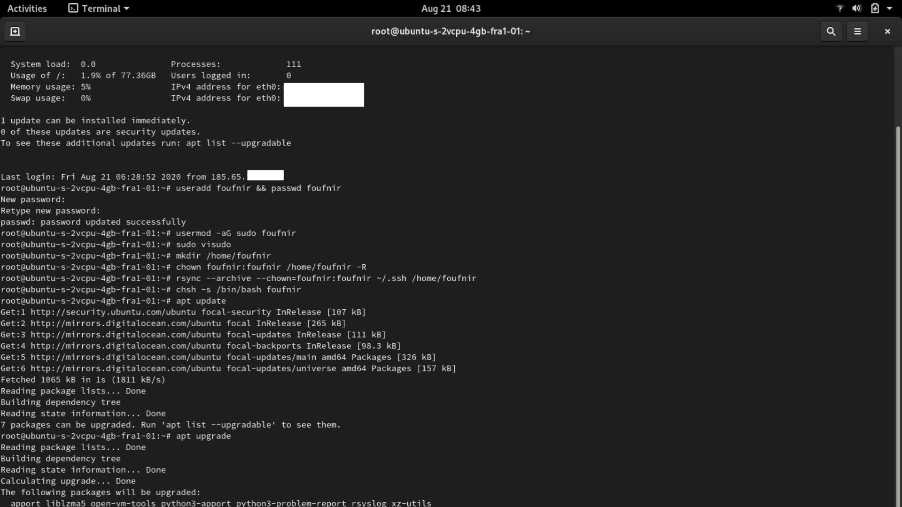

``` jsx
apt upgrade -y
```
```jsx
sudo apt-get install automake build-essential pkg-config libffi-dev libgmp-dev libssl-dev libtinfo-dev libsystemd-dev zlib1g-dev make g++ tmux git jq wget libncursesw5 libtool autoconf -y
```

### Firewalls, and SSH ports

We have a non-root user, updated our OS and installed the necessary packages, let's now setup our firewalls, as well as open the specific ports we will be using for our server.

**3.06** First, let's disable our firewall, so we don't get locked out when configurating it:
``` jsx
ufw disable
```
**3.07** Now we are going to edit the *sshd_config* file, so we can change the default port of access, as well as some additional settings:
``` jsx
nano /etc/ssh/sshd_config
```
**3.08** We will be using port 3100 as the default port to access our server. Change the line "#Port 22" to "Port 3100". Make sure to remove the "#":
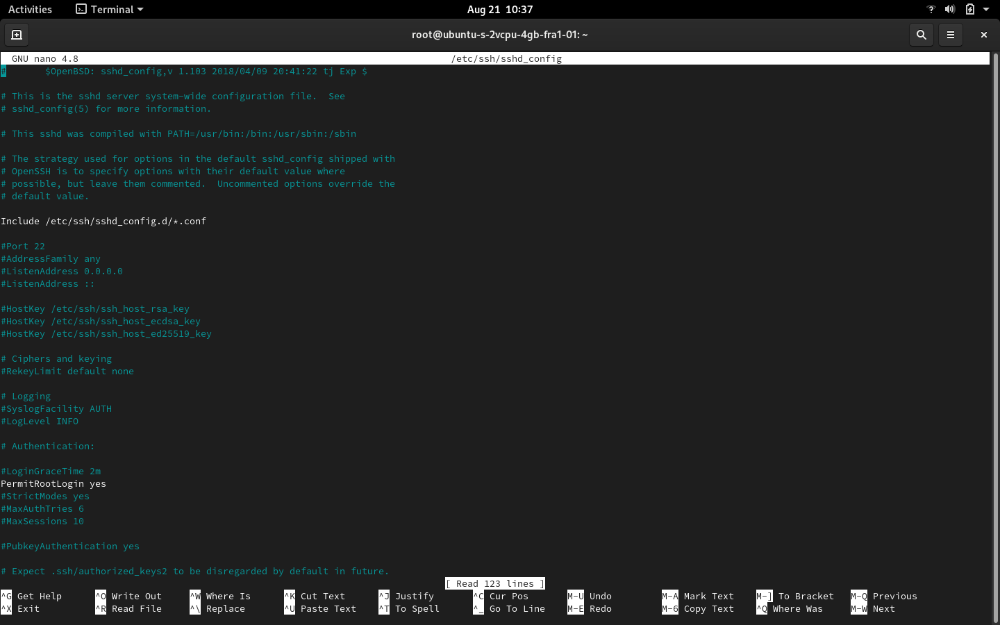
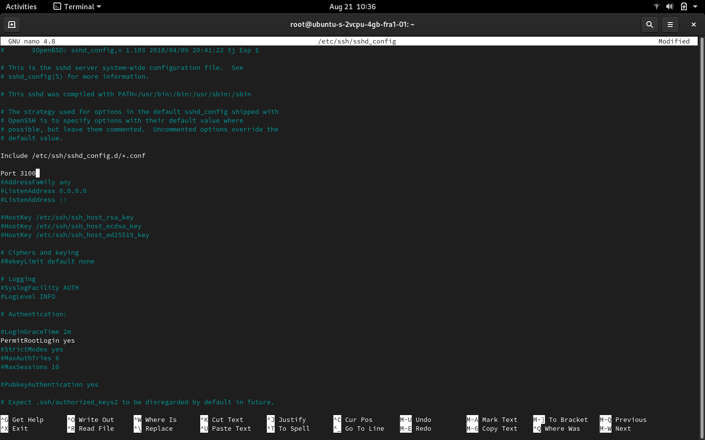

**3.09** Scroll down, and let's change two more additional settings. First, replace "#TCPKeepAlive yes" to "TCPKeepAlive no". Second, replace "#ClientAliveInterval 0" with "ClientAliveInterval 1800":

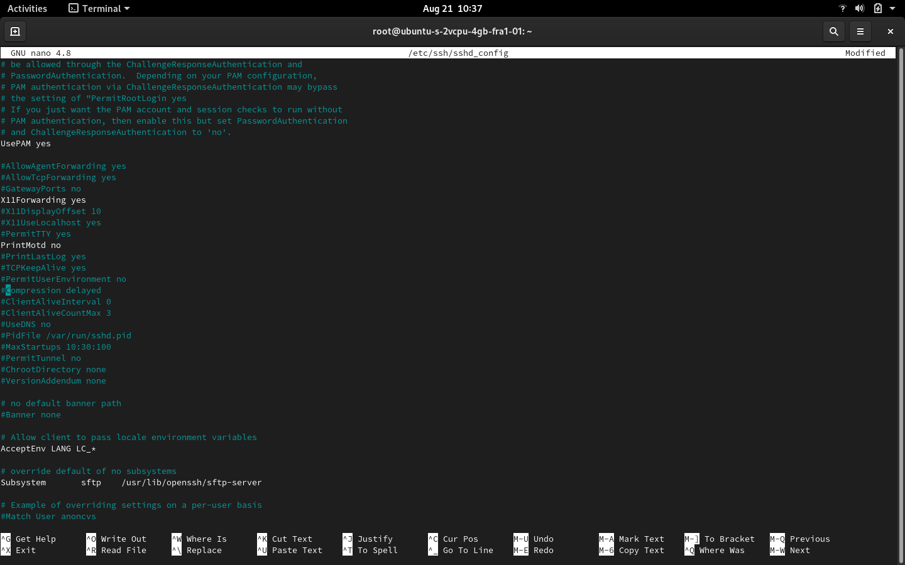
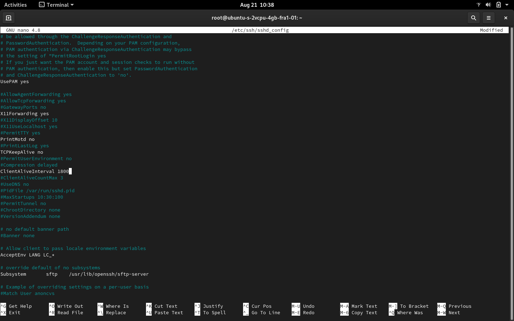

:::note
To go back to the Terminal, save the file with *ctrl + o*, and leave the editor with *ctrl + x*.
:::
:::caution Are you delegating to POA?
If not, please do. It's the only way we generate funds, which we can afterwards use to invest in our activities in Africa to get Cardano adopted there, but also to create more of the guides like the one you are currently using to create your stakepool.

Our ticker is **[POA](https://adapools.org/pool/683e89fa1bcde139504b11fbfd914f8ebe9b8db2678b3da0abdcb2f1)**. You know what to do.

**Make the difference. #StakeWithAfrica**
:::
**3.10** Execute the following commands, which will allow outgoing connections, but will by default deny incoming connections:

``` jsx
ufw default deny incoming
```
``` jsx
ufw default allow outgoing
```
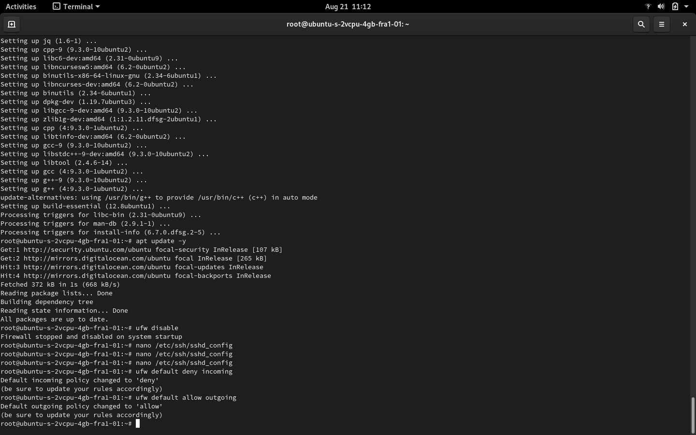
**3.11** We are now going to open the SSH port we will be using to connect to our server:
```jsx
ufw limit proto tcp from any to any port 3100
```
**3.12** Finally, we are going to open port 3000, as that's the port we will be using for our block-producing node
```jsx
ufw allow proto tcp from any to any port 3000
```
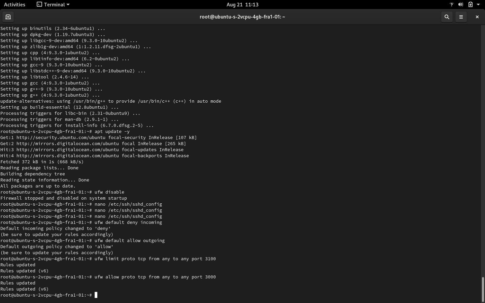
**3.13** Now re-enable the firewall (make sure to enter "y" to confirm):
```jsx
ufw enable
```
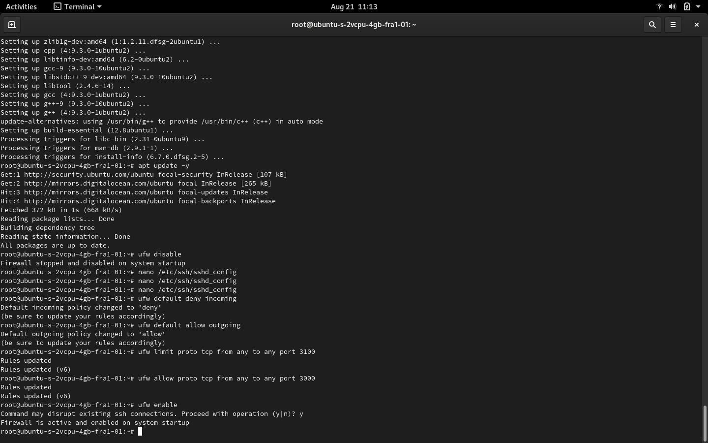
**3.14** Let's double-check we opened the right ports:
```jsx
ufw status verbose
```
**3.15** And double-check if your new user is in the "sudo group":
``` jsx
grep '^sudo:.*$' /etc/group | cut -d: -f4
```
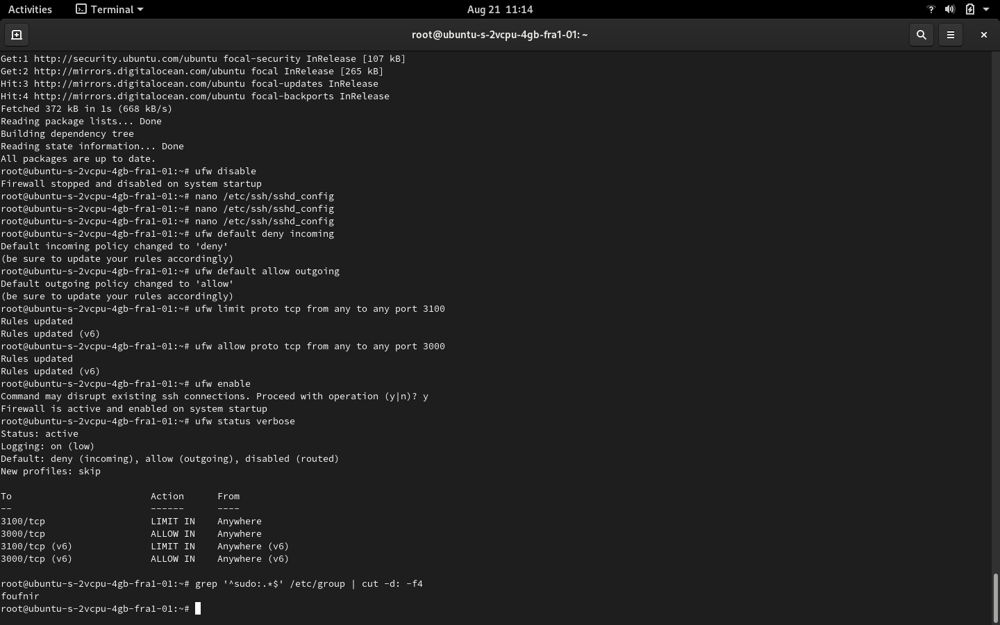

**3.16** It's REBOOT time! Let's restart the server:
``` jsx
reboot
```

### Logging in as our new user

**3.17** Take a quick break now, just couple of minutes. Once you are done, execute the following command in order to log into your server, with the new user you created a bit earlier in this guide:

``` jsx
ssh -i ~/.ssh/myssh YourUserName@TheIPAddressOfYourServer -p 3100
```
:::note
Make sure to replace "YourUserName" with your username, and "TheIPAddressOfYourServer" with the IP address of your server.
:::
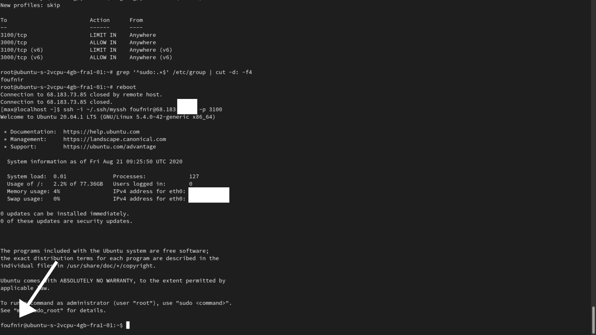
**3.18** Congratulations! You are now logged in as your new user, on your server. Let's now remove the root user access, so we are a 100% sure that no one will be able to take the dictator position:

``` jsx
sudo nano /etc/ssh/sshd_config
```
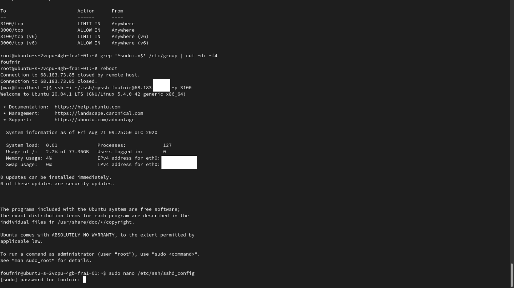

**3.19** Change the "PermitRootLogin yes" line to "PermitRootLogin no"
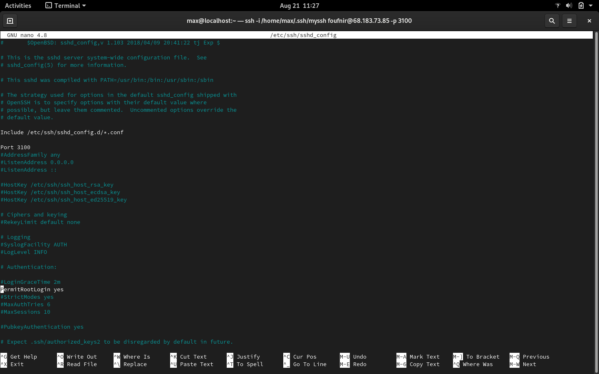
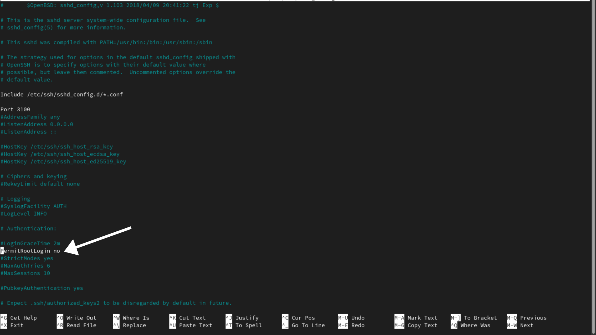
:::note
To quit the nano editor, press *ctrl + o* to save the file, and *ctrl + x* to leave the editor.
:::

**3.20** Now finally, reload the SSH daemon:
``` jsx
sudo service sshd reload
```

Et voilà! Your server is now finally configured, and you can head over to the fourth step of this guide.

:::note Become part of the POA community!
If you want to meet other builders and global shapers, make sure to join our **[Telegram chat](https://t.me/poapool)**, where most of our community is hanging out. Oh, and if you have a question, you can also ask it there!
:::
