OK! In this second part of the guide, we will be setting up our first server on DigitalOcean. If you are using another cloud provider, feel free to skip this step, and go directly to the third part of the guide.

### Generating your SSH keys

There are two ways to connect to a server. The first one, is by using a password. This is commonly considered as not optimal, simply because passwords can be hacked. To connect to our servers, we will thus be using what is called an SSH connection. This means we will need to generate SSH keys, one public key, and one private. Like in crypto, you want to keep your private key private, but your public key can of course be public. That's how simple it is.

**2.01** Open the **terminal**, and execute the following command:

```jsx
cd .ssh
```

:::note
If you don't have this .ssh folder, no worries. You can create one with the following command:
```jsx
mkdir .ssh
```
And you can enter it with the following command:
```jsx
cd .ssh
```
:::

**2.02** Now we are into the .ssh folder, we can create an SSH key pair with the following command:

```jsx
ssh key-gen
```

**2.03** Enter "myssh" as name.

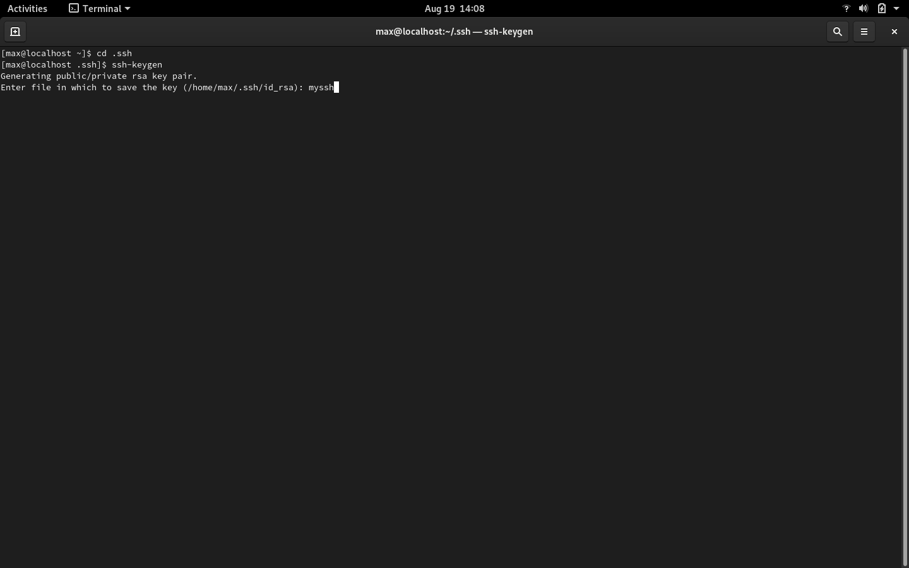

**2.04** Now enter a password, confirm it, and you should now see the following:

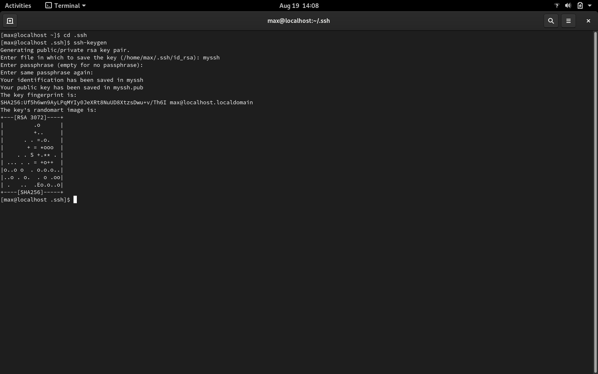

**2.05** Let's lock up our private SSH key for additional security:

```jsx
chmod 400 myssh
```

Congratulations! You now have successfully created your own SSH key pair, which will allow you to connect to your server, which we are now going to create.

### Creating your DigitalOcean server

Now we have our own SSH keys we will be using to connect to the server, let's actually create this server. If you are new to DigitalOcean, you will want to deposit 20$ on it, which you will need to during the registration of your DigitalOcean account.

:::note
Depending on whether or not you have already been using DigitalOcean in the past, you may have a different process regarding the server configuration. If that's the case, pay close attention to what the specifications are of the server we will be using.
:::

**2.06** Open your **browser**, go to **https://digitalocean.com**, and create an account or log in if you already have an account.

**2.07** Now you are on DigitalOcean, the first step consists of selecting the droplet option after clicking the "create" button:

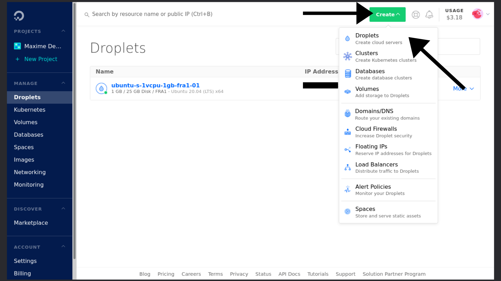

**2.08** Leave the OS option and the plan option like it is:

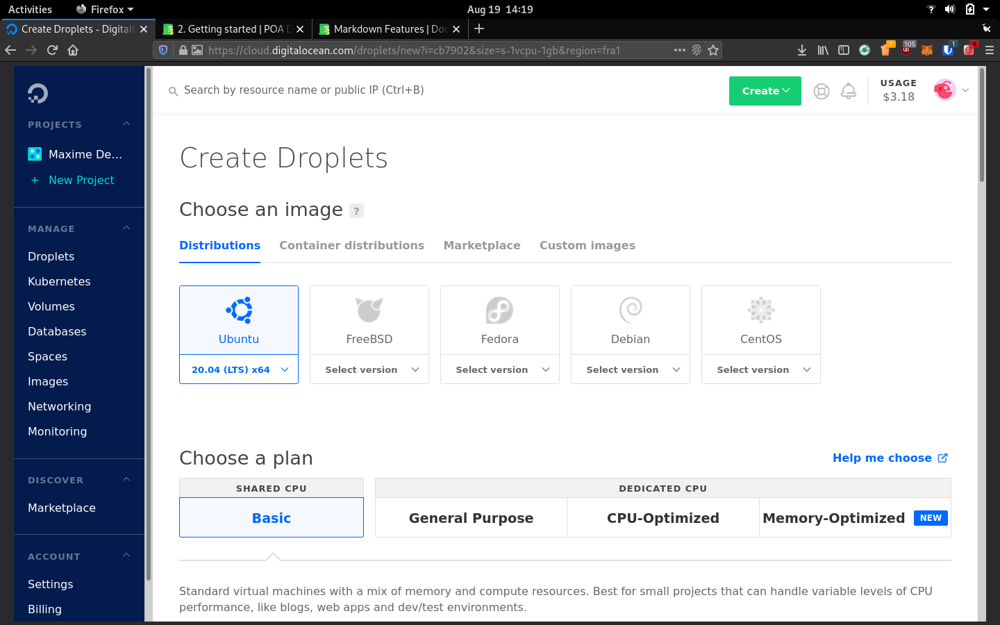

:::caution Are you delegating to POA?
If not, please do. It's the only way we generate funds, which we can afterwards use to invest in our activities in Africa to get Cardano adopted there, but also to create more of the guides like the one you are currently using to create your stakepool.

Our ticker is **[POA](https://adapools.org/pool/683e89fa1bcde139504b11fbfd914f8ebe9b8db2678b3da0abdcb2f1)**. You know what to do.

**Make the difference. #StakeWithAfrica**
:::
**2.09** Scroll down, and select the 20$ monthly plan. Double check the specifications to make sure you are selecting the right server:

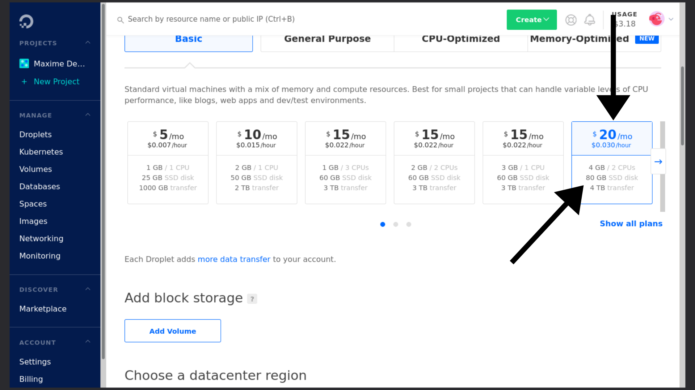

**2.10** Feel free to select a different location.

:::note
There are two things worth taking in consideration regarding the server's location.

First, most stakepool operators are either based in the US, or in Europe. Ideally, you want your nodes to be active there, so the connection to other nodes is as fast as possible.

Second, you don't want to take a server at the other side of the world, because your terminal-experience will then be slower.
:::

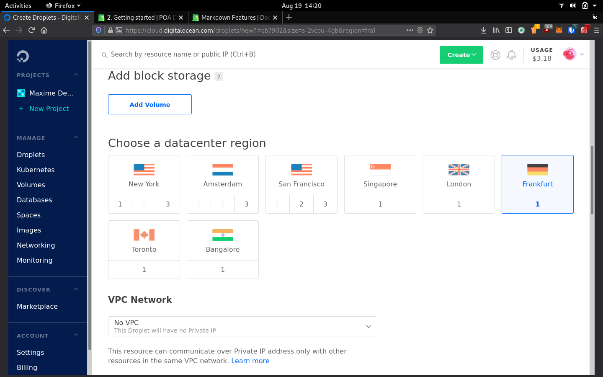

**2.11** Scroll down, then click on "New SSH Key":

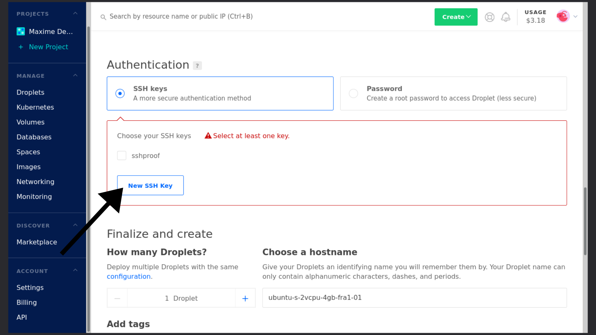

**2.12** Now go back to the **terminal** and execute the following command to view your public SSH key:

:::note
Make sure you are still in the .ssh folder, if not, execute the following commands first:

```jsx
cd
```

```jsx
cd .ssh
```
:::

```jsx
cat myssh.pub
```

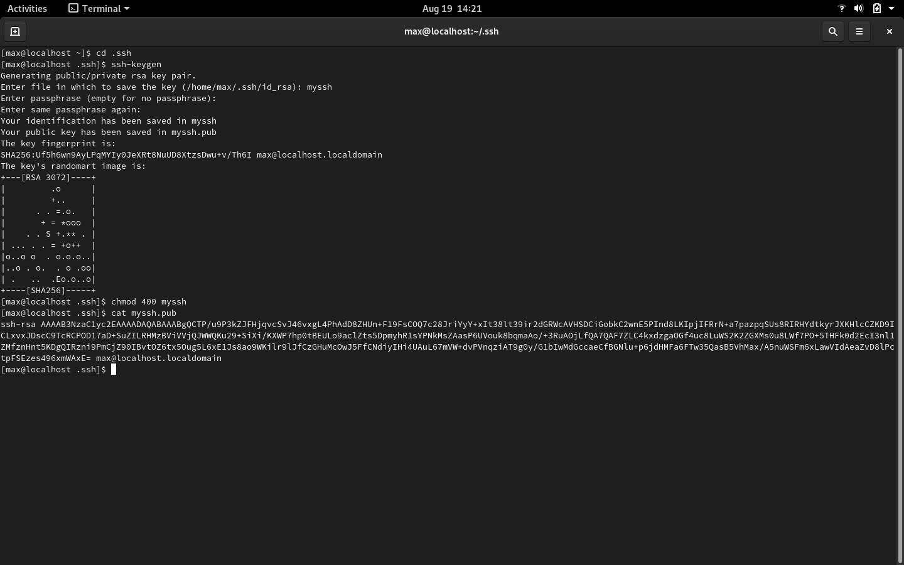

**2.13** Select the whole SSH public key (starting from "ssh-rsa"), copy it, go back to DigitalOcean, paste it there, and finally give it a name:

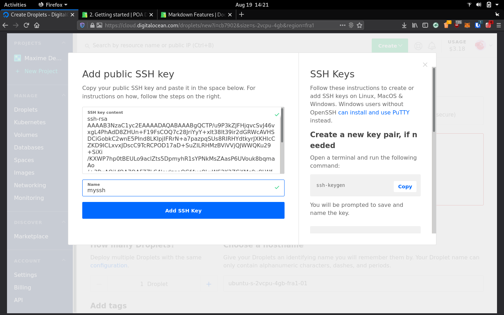

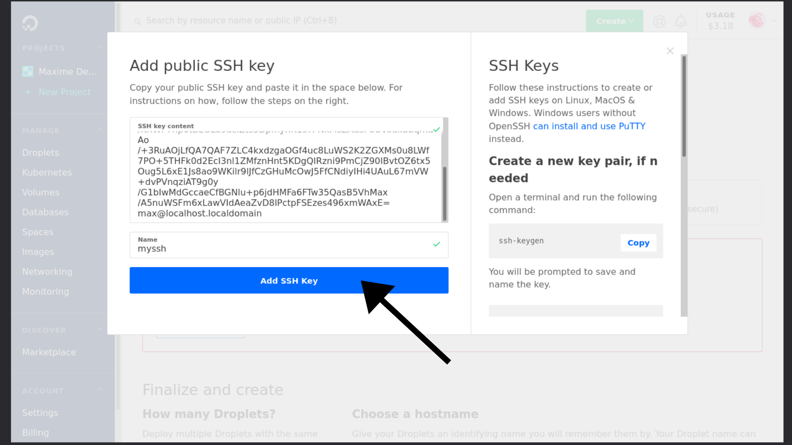

**2.14** Simply click on "Create Droplet":

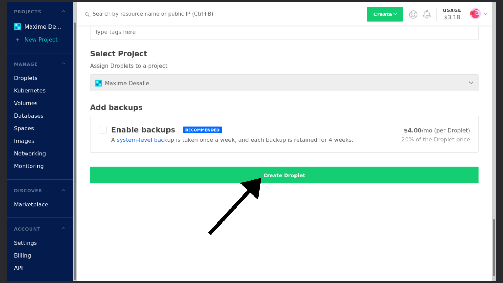

**2.15** Et voilà! You know have successfully created a server on DigitalOcean, and you can see the IP address (I hided a part of it, because I'm paranoid) of your server, which we will be using to log into it:

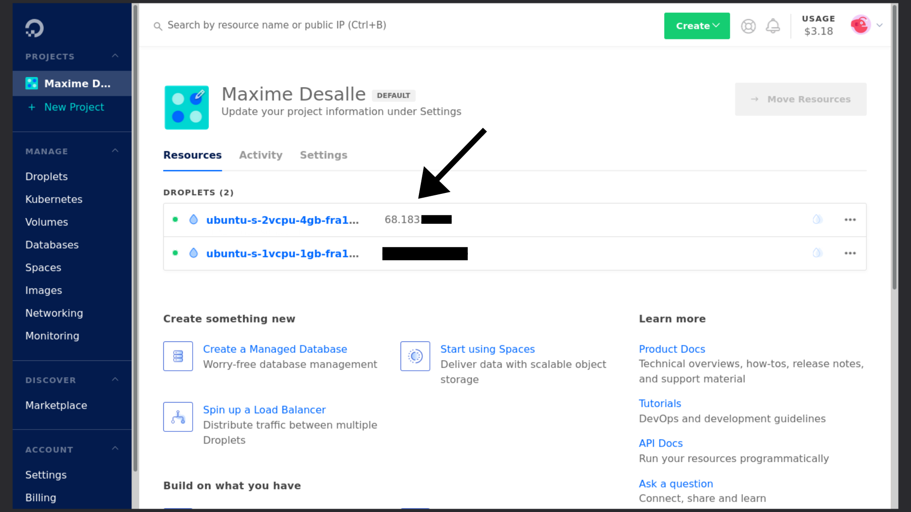

### Connecting to your server

**2.16** To connect to your server, simply execute the following command in a new tab in the terminal:

```jsx
ssh -i ~/.ssh/myssh root@THE-IP-ADDRESS-OF-YOUR-SERVER
```

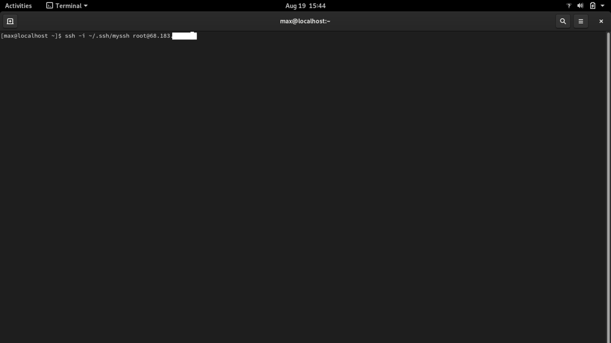

And as we haven't created a password, you should normally directly be in the server:

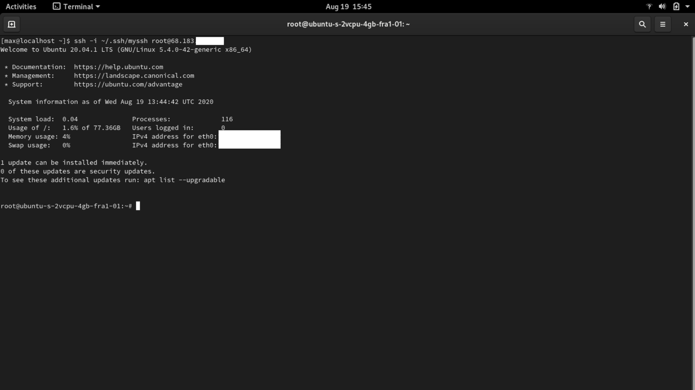

Congratulations! You can now go to the third part of this guide, where we will be configuring the server.

:::note Become part of the POA community!
If you want to meet other builders and global shapers, make sure to join our **[Telegram chat](https://t.me/poapool)**, where most of our community is hanging out. Oh, and if you have a question, you can also ask it there!
:::
