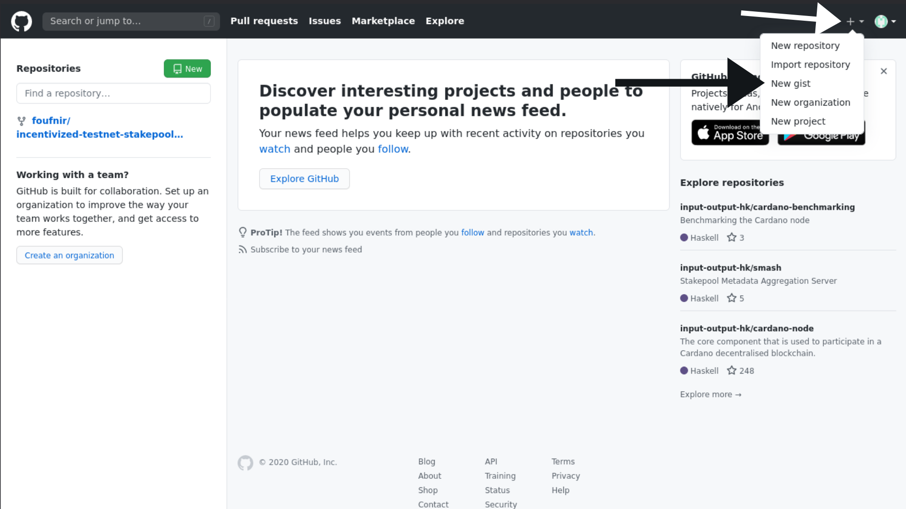
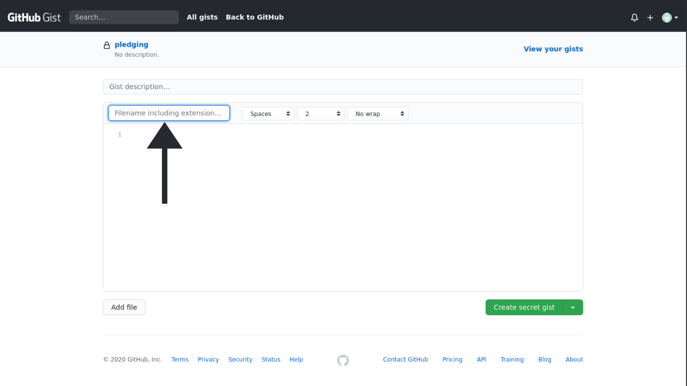
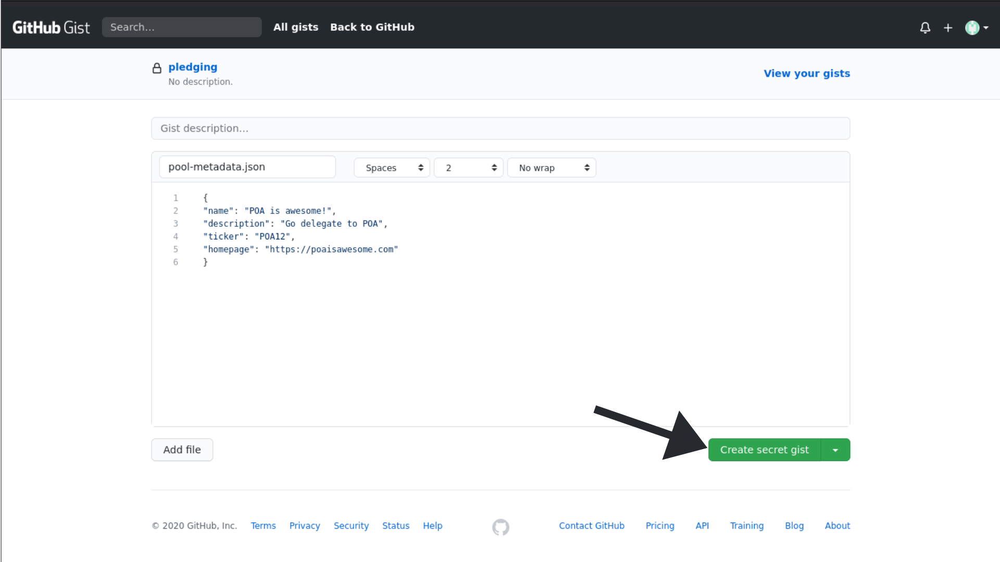
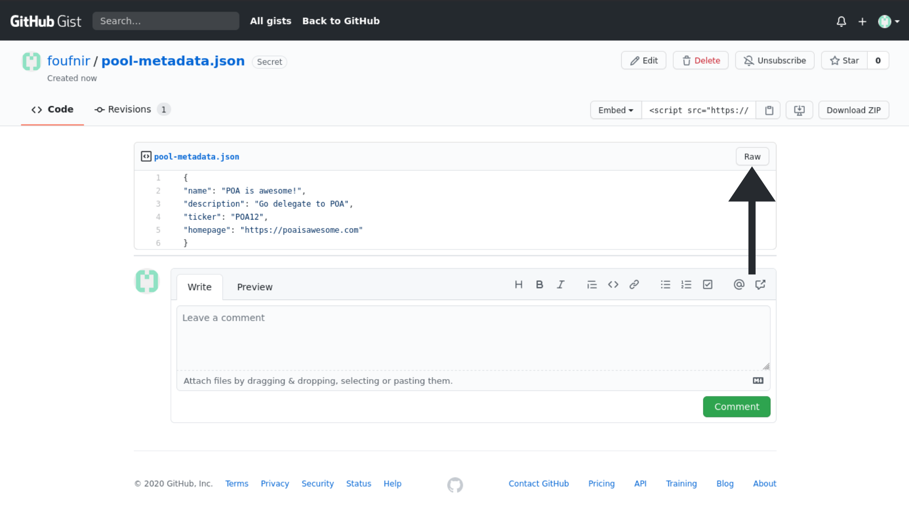
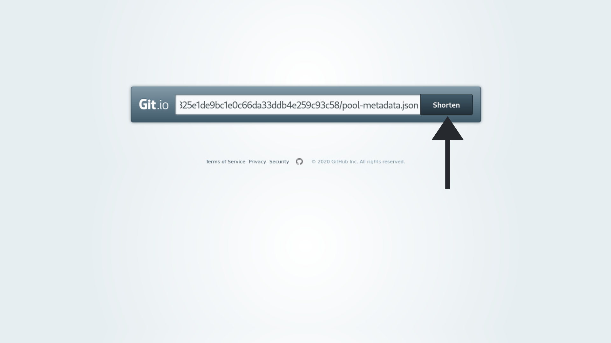
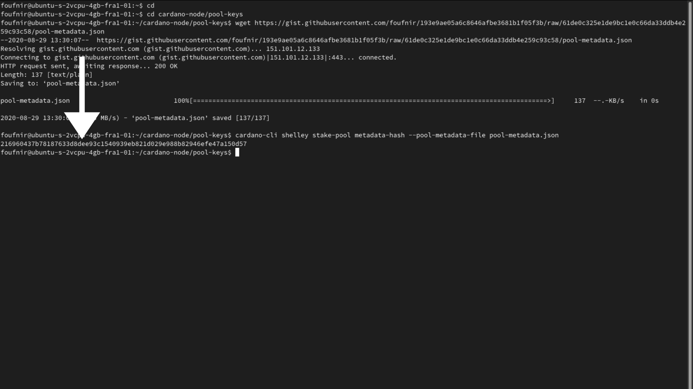
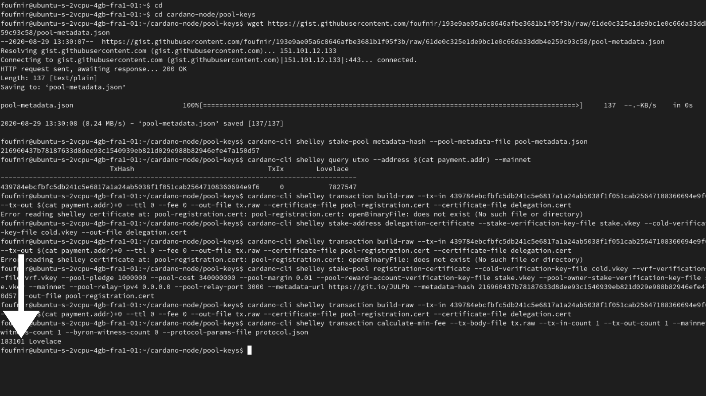

In this part of the guide, we will **FINALLY** be registering our stakepool.

### Creating the *metadata.json* file

In order to register our stakepool, we need to provide a *metadata.json* file, which is where we will store all the practical information regarding the stakepool. This includes, the name, the website, the ticker, as well as the description.

To do this, we will need to store somewhere this file. It needs to be in some place. So we will be storing it on GitHub.

**8.01** If you haven't a GitHub account yet, create one now **[here](https://github.com)**. If you have one already, please log into it.

**8.02** Now click on the *+* icon on the right, and select *New gist*.

**8.03** Give it the following name:
```jsx
pool-metadata.json
```

**8.04** Now copy paste this into the content of the file:
```jsx
{
"name": "TestPool",
"description": "The pool that tests all the pools",
"ticker": "TEST",
"homepage": "https://teststakepool.com"
}
```

**8.05** You can adapt the content of the *pool-metadata.json* file, so it suits your needs. Mine will look like this:
```jsx
{
"name": "POA is awesome!",
"description": "Go delegate to POA",
"ticker": "POA12",
"homepage": "https://poaisawesome.com"
}
```
**8.06** Once you are done (make sure to triple-check if you entered everything correctly), you can now click on the green *Create secret gist* button


**8.07** Now click on *Raw*



**8.08** OK! Now copy the URL link when you are on the RAW page


**8.09** Go on **[git.io](https://git.io)**, and paste the URL, then click on *Shorten*



**8.10** Well, let's download the file now! Get into your terminal, get out of any folder, enter the *pool-keys* folder, and download the file

```jsx
cd
```

```jsx
cd cardano-node/pool-keys
```

:::note
Make sure to replace *TheUrlOfYourRawPage* with the URL OF YOUR RAW PAGE, NOT THE SHORTENED URL from step **8.09**.

In my case, I will be using the following command:
```jsx
wget https://gist.githubusercontent.com/foufnir/193e9ae05a6c8646afbe3681b1f05f3b/raw/61de0c325e1de9bc1e0c66da33ddb4e259c93c58/pool-metadata.json
```
:::

```jsx
wget TheUrlOfYourRawPage
```

**8.11** Now execute the following command:

```jsx
cardano-cli shelley stake-pool metadata-hash --pool-metadata-file pool-metadata.json
```


On the picture above, you can see the hash of the file indicated with the arrow. We will be using this during the registration process.

:::caution Are you delegating to POA?
If not, please do. It's the only way we generate funds, which we can afterwards use to invest in our activities in Africa to get Cardano adopted there, but also to create more of the guides like the one you are currently using to create your stakepool.

Our ticker is **[POA](https://adapools.org/pool/683e89fa1bcde139504b11fbfd914f8ebe9b8db2678b3da0abdcb2f1)**. You know what to do.

**Make the difference. #StakeWithAfrica**
:::

### Generating the stakepool certificate

We are now going to generate the certificate. Make sure to triple-check everything!

:::note
- Replace *YourPledgeInLovelaces*, with the amount in Lovelaces in your wallet (*payment.addr*), which you are willing to pledge.

- Replace *YourFixedCostInLovelaces*, with the amount in Lovelaces you are willing to charge. The **minimum is 340 ADA**, or 340 million Lovelaces.

- Replace *YourPoolMarginInPercentage*, with the amount you are willing to charge in percentage, like *0.01* for example for a 1% fee.

- Replace *TheIPaddressOfYourRelayNode*, with the IP address of your relay node server.

- Replace *TheURLYouShortened*, with the URL you shortened on [git.io](https://git.io).

- Replace *TheHashOfYourPoolMetadataFile*, with the hash of your *pool-metadata.json* file which you found in step **8.11**.

In my case, the command I will be using looks like this:
```jsx
cardano-cli shelley stake-pool registration-certificate --cold-verification-key-file cold.vkey --vrf-verification-key-file vrf.vkey --pool-pledge 1000000 --pool-cost 340000000 --pool-margin 0.01 --pool-reward-account-verification-key-file stake.vkey --pool-owner-stake-verification-key-file stake.vkey --mainnet --pool-relay-ipv4 0.0.0.0 --pool-relay-port 3000 --metadata-url https://git.io/JULPb --metadata-hash 216960437b78187633d8dee93c1540939eb821d029e988b82946efe47a150d57 --out-file pool-registration.cert
```
:::
```jsx
cardano-cli shelley stake-pool registration-certificate --cold-verification-key-file cold.vkey --vrf-verification-key-file vrf.vkey --pool-pledge YourPledgeInLovelaces --pool-cost YourFixedCostInLovelaces --pool-margin YourPoolMarginInPercentage --pool-reward-account-verification-key-file stake.vkey --pool-owner-stake-verification-key-file stake.vkey --mainnet --pool-relay-ipv4 TheIPaddressOfYourRelayNode --pool-relay-port 3000 --metadata-url TheURLYouShortened --metadata-hash TheHashOfYourPoolMetadataFile --out-file pool-registration.cert
```

### Generating your delegation certifcate

In order to make our pledge official, we need to generate a certificate:

**8.12** Execute the following command to generate the certificate:

```jsx
cardano-cli shelley stake-address delegation-certificate --stake-verification-key-file stake.vkey --cold-verification-key-file cold.vkey --out-file delegation.cert
```

### Calculating the fees, building the transaction, and submitting it

**8.13** Let's build a draft transaction, so we can calculate the fees:

:::note
Make sure to replace *YourOwnUTxO* with your UTxO address. Don't remember, or can't find it? Here is the command:

```jsx
cardano-cli shelley query utxo --address $(cat payment.addr) --mainnet
```
Replace *TheNumberOfTransactionsMadeTotheUTxO* with the number of transactions made to the UTxO. You can find it by executing the command above. Make sure to leave the hashtag in between!

In my case, I will be executing the following command:
```jsx
cardano-cli shelley transaction build-raw --tx-in 439784ebcfbfc5db241c5e6817a1a24ab5038f1f051cab25647108360694e9f6#0 --tx-out $(cat payment.addr)+0 --ttl 0 --fee 0 --out-file tx.raw --certificate-file pool-registration.cert --certificate-file delegation.cert
```
:::
```jsx
cardano-cli shelley transaction build-raw --tx-in YourOwnUTxO#TheNumberOfTransactionsMadeTotheUTxO --tx-out $(cat payment.addr)+0 --ttl 0 --fee 0 --out-file tx.raw --certificate-file pool-registration.cert --certificate-file delegation.cert
```

**8.14** And calculate the fees:

```jsx
cardano-cli shelley transaction calculate-min-fee --tx-body-file tx.raw --tx-in-count 1 --tx-out-count 1 --mainnet --witness-count 1 --byron-witness-count 0 --protocol-params-file protocol.json
```


Like you can see above, the fee in my case will be 183101 Lovelaces. This will likely be different for you. So make sure to double-check the fees in the following commands.

**8.15** It's math time! Let's calculate how much we need to pay back the UTxO:

:::note
Make sure to replace *TheAmountOfLovelacesInYourUTxO* with the amount in Lovelaces in your UTxO.

And replace *TheFeeInLovelaces* with the fee you calculated in step **8.14**.
:::
```jsx
expr TheAmountInLovelacesInYourUTxO - 500000000 - TheFeeInLovelaces
```

**8.16** Calculate the TTL, and build the transaction:

```jsx
cardano-cli shelley query tip --mainnet
```

:::note
Make sure to replace *slotNo* with the value for *slotNo* you found after executing the previous command.
:::

To calculate the TTL, execute the following command:
```jsx
expr slotNo + 1000
```

:::note
- Make sure to replace *YourOwnUTxO* with your UTxO address. Don't remember, or can't find it? Here is the command:

```jsx
cardano-cli shelley query utxo --address $(cat payment.addr) --mainnet
```
- Replace *TheNumberOfTransactionsMadeTotheUTxO* with the number of transactions made to the UTxO. You can find it by executing the command above. Make sure to leave the hashtag in between!

- Replace *TheAmountToPayBackToYourUTxOWeCalculatedInStep8Dot15* with the amount in Lovelaces you calculated in step **8.15**.

- Replace *TheTTL* with the TTL you calculated in the previous command.

- Replace *TheFee* with the fee in Lovelaces you calculated in step **8.14**.
:::

```jsx
cardano-cli shelley transaction build-raw --tx-in YourOwnUTxO#TheNumberOfTransactionsMadeTotheUTxO --tx-out $(cat payment.addr)+TheAmountToPayBackToYourUTxOWeCalculatedInStep8Dot15 --ttl TheTTL --fee TheFee --out-file tx.raw --certificate-file pool-registration.cert --certificate-file delegation.cert
```

**8.17** Sign the transaction

```jsx
cardano-cli shelley transaction sign --tx-body-file tx.raw --signing-key-file payment.skey --signing-key-file stake.skey --signing-key-file cold.skey --mainnet --out-file tx.signed
```

**8.18** And submit!

```jsx
cardano-cli shelley transaction submit --tx-file tx.signed --mainnet
```

**8.19** Now check your *pool ID*:

```jsx
cardano-cli shelley stake-pool id --verification-key-file cold.vkey
```

**8.20** Now go to **[PoolTool](https://pooltool.io)**, and look up the pool ID in the search bar. If you can find your stakepool, good job! If you can't, wait a couple of minutes, check back, and if it's still not there, you likely did something wrong.

:::note Become part of the POA community!
If you want to meet other builders and global shapers, make sure to join our **[Telegram chat](https://t.me/poapool)**, where most of our community is hanging out. Oh, and if you have a question, you can also ask it there!
:::
